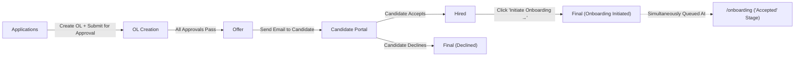
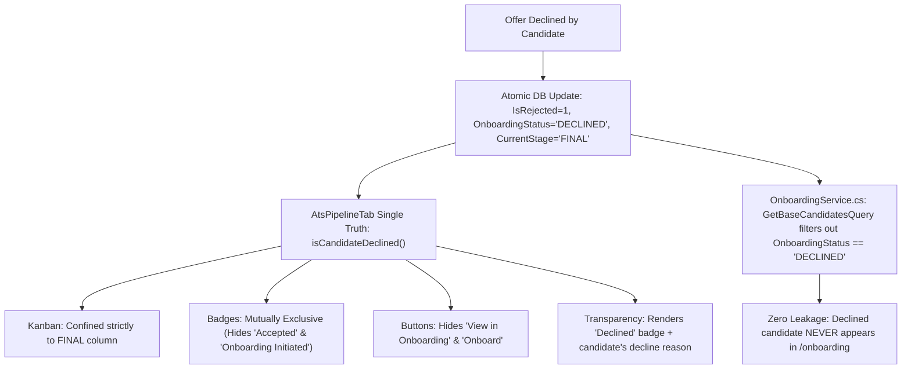

# ATS Pipeline — Stage-by-Stage Fix Walkthrough

> [!IMPORTANT]
> Every fix below is **database-driven**. Zero hardcoded/mock data. All values come from SQL Server via existing API endpoints. Where a new endpoint or field is needed, it is explicitly called out with the exact backend file, method, and DTO change required.

---

## Current Architecture Map



### Key Files Involved

| Layer | File | Purpose |
|-------|------|---------|
| Frontend Kanban | [`AtsPipelineTab.tsx`](file:///Volumes/Office%20Work/Github/HRMS-Solution/frontend/src/modules/recruitment/components/AtsPipelineTab.tsx) | Kanban board — card rendering, click handlers, stage buttons |
| Frontend Pipeline View | [`AtsPipelineView.tsx`](file:///Volumes/Office%20Work/Github/HRMS-Solution/frontend/src/modules/recruitment/pipeline/AtsPipelineView.tsx) | Parent view — drawer orchestration, data loading |
| Frontend Create OL Drawer | [`CreateOfferLetterDrawer.tsx`](file:///Volumes/Office%20Work/Github/HRMS-Solution/frontend/src/modules/recruitment/drawers/CreateOfferLetterDrawer.tsx) | 4-step OL creation wizard |
| Frontend CandidateOfferDrawer | [`CandidateOfferDrawer.tsx`](file:///Volumes/Office%20Work/Github/HRMS-Solution/frontend/src/modules/recruitment/drawers/CandidateOfferDrawer.tsx) | Thin wrapper → delegates to CreateOfferLetterDrawer |
| Frontend API | [`api.ts`](file:///Volumes/Office%20Work/Github/HRMS-Solution/frontend/src/modules/recruitment/api.ts) | Frontend API client (missing `dispatchOfferEmail` method) |
| Frontend Types | [`types.ts`](file:///Volumes/Office%20Work/Github/HRMS-Solution/frontend/src/modules/recruitment/types.ts) | DTOs, stage constants |
| Frontend Acceptance Portal | [`OfferAcceptancePortalView.tsx`](file:///Volumes/Office%20Work/Github/HRMS-Solution/frontend/src/modules/recruitment/components/OfferAcceptancePortalView.tsx) | Public acceptance page (exists at `/offer/accept/[token]`) |
| Backend Controller | [`RecruitmentController.cs`](file:///Volumes/Office%20Work/Github/HRMS-Solution/backend/Api/Controllers/RecruitmentController.cs) | REST endpoints (L244: `POST offers/{id}/dispatch-email`) |
| Backend Service | [`RecruitmentService.cs`](file:///Volumes/Office%20Work/Github/HRMS-Solution/backend/Infrastructure/Services/RecruitmentService.cs) | Business logic (L1358-1481: CreateOffer sets stage to `OFFER` not `OL_CREATION`) |
| Backend Email Service | [`EmailService.cs`](file:///Volumes/Office%20Work/Github/HRMS-Solution/backend/Infrastructure/Services/EmailService.cs) | Email dispatch, acceptance, and token logic |
| Backend Enums | [`SystemEnums.cs`](file:///Volumes/Office%20Work/Github/HRMS-Solution/backend/Domain/Enums/SystemEnums.cs) | `RecruitmentStage` enum (missing `OL_CREATION` value) |

---

## Bug #1 — "Create Offer Letter" Drawer Opens at Every Stage

### Root Cause

In [`AtsPipelineTab.tsx`](file:///Volumes/Office%20Work/Github/HRMS-Solution/frontend/src/modules/recruitment/components/AtsPipelineTab.tsx#L431-L443), the **card `onClick` handler** (L431-443) calls `onOpenCreateOffer(c)` for `APPLICATIONS`, `OL_CREATION`, and `OFFER` stages — all three. It should ONLY open the "Create OL" drawer when the candidate is in `APPLICATIONS`.

```tsx
// CURRENT (BUG) — L431-443
onClick={() => {
  if (
    col.code === "APPLICATIONS" ||
    col.code === "APPLIED" ||
    col.name.toLowerCase().includes("application") ||
    col.code === "OL_CREATION" ||   // ← BUG: opens OL creation form for OL_CREATION stage
    col.code === "OFFER"             // ← BUG: opens OL creation form for OFFER stage
  ) {
    onOpenCreateOffer(c);
  } else {
    onSelectCandidate(c);
  }
}}
```

Also in the **Card Action Row** (L524-532), the left button renders "OL Creation" for `OFFER`, `OL_CREATION`, `APPLICATIONS` — all three:

```tsx
// CURRENT (BUG) — L524
col.code === "OFFER" || col.code === "OL_CREATION" || col.code === "APPLICATIONS" ...
```

And the **Next Stage Button** (L546-554) also opens the OL form when `nextCol` is `OFFER` or `OL_CREATION`:

```tsx
// CURRENT (BUG) — L546-554
if (nextCol.code === "OFFER" || nextCol.code === "OL_CREATION" || ...)
  onOpenCreateOffer(c);   // ← Opens OL form even for non-Application stages
```

### Fix

**File: [`AtsPipelineTab.tsx`](file:///Volumes/Office%20Work/Github/HRMS-Solution/frontend/src/modules/recruitment/components/AtsPipelineTab.tsx)**

#### Fix 1a — Card `onClick` (L431-443)

Replace with stage-aware logic:
- **`APPLICATIONS`/`APPLIED`** → Open Create OL Drawer (`onOpenCreateOffer`)
- **`OL_CREATION`** → Open View OL Drawer (new `onOpenViewOffer` callback — see Bug #2)
- **`OFFER`** → Open Offer/Approval Drawer (new `onOpenOfferDetail` callback — see Bug #3)
- **All other stages** → Open CandidateDetailDrawer (`onSelectCandidate`)

```tsx
// FIXED
onClick={() => {
  if (col.code === "APPLICATIONS" || col.code === "APPLIED") {
    onOpenCreateOffer(c);          // Only Applications can create OL
  } else if (col.code === "OL_CREATION") {
    onOpenViewOffer?.(c);          // View-only OL drawer
  } else if (col.code === "OFFER") {
    onOpenOfferDetail?.(c);        // Approval + Send-to-Candidate drawer
  } else {
    onSelectCandidate(c);          // Default detail drawer
  }
}}
```

#### Fix 1b — Card Action Row left button (L524-532)

Replace with stage-specific buttons:
- **`APPLICATIONS`** → "OL Creation" button (creates offer)
- **`OL_CREATION`** → "View OL" button (view-only)
- **`OFFER`** → "Offer →" button (opens approval/send drawer)
- **`HIRED`** → Show "Initiate Onboarding →" (already exists)

```tsx
// FIXED action button row
col.code === "APPLICATIONS" || col.code === "APPLIED" ? (
  <button onClick={() => onOpenCreateOffer(c)} ...>
    <FileText /> OL Creation
  </button>
) : col.code === "OL_CREATION" ? (
  <button onClick={() => onOpenViewOffer?.(c)} ...>
    <Eye /> View OL
  </button>
) : col.code === "OFFER" ? (
  <button onClick={() => onOpenOfferDetail?.(c)} ...>
    <FileText /> Offer →
  </button>
) : (
  <span>{date}</span>
)
```

#### Fix 1c — Next Stage Button (L546-554)

Remove the special-case that opens OL form for next stages. Only `APPLICATIONS` → `OL_CREATION` should open the OL form:

```tsx
// FIXED next-stage button
if (col.code === "APPLICATIONS" || col.code === "APPLIED") {
  onOpenCreateOffer(c);    // Only from Applications
} else {
  onQuickMoveStage(c.id, nextCol.code);  // Normal progression
}
```

#### Fix 1d — Add new props to `AtsPipelineTabProps`

```tsx
interface AtsPipelineTabProps {
  // ... existing props
  onOpenViewOffer?: (candidate: CandidateDto) => void;      // NEW
  onOpenOfferDetail?: (candidate: CandidateDto) => void;    // NEW
}
```

---

## Bug #2 — OL Creation Stage: View-Only Drawer + Auto-Move to OL_CREATION

### Root Cause (Backend)

In [`RecruitmentService.cs`](file:///Volumes/Office%20Work/Github/HRMS-Solution/backend/Infrastructure/Services/RecruitmentService.cs#L1390-1398) (L1390-1398), when an OL is created with `submitForApproval = true`, the candidate's `CustomStageCode` is set to `"OFFER"` — but it should be set to `"OL_CREATION"` because the offer hasn't been approved yet.

```csharp
// CURRENT (BUG) — L1394-1396
candidate.ApprovalStatus = "PENDING_APPROVAL";
candidate.CurrentStage = RecruitmentStage.OFFER;      // ← Wrong! Should be OL_CREATION
candidate.CustomStageCode = "OFFER";                   // ← Wrong! Should be OL_CREATION
```

Similarly for the non-submit path (L1474-1478):
```csharp
// CURRENT (BUG) — L1474-1478
candidate.ApprovalStatus = "DRAFT";
candidate.CurrentStage = RecruitmentStage.OFFER;      // ← Wrong!
candidate.CustomStageCode = "OFFER";                   // ← Wrong!
```

### Fix (Backend)

**File: [`RecruitmentService.cs`](file:///Volumes/Office%20Work/Github/HRMS-Solution/backend/Infrastructure/Services/RecruitmentService.cs)**

#### Fix 2a — SubmitForApproval path (L1394-1396)
```csharp
// FIXED
candidate.ApprovalStatus = "PENDING_APPROVAL";
candidate.CurrentStage = RecruitmentStage.OFFER;        // Enum stays OFFER (no OL_CREATION enum value)
candidate.CustomStageCode = "OL_CREATION";              // ← Custom stage code drives Kanban column
```

#### Fix 2b — Non-submit (Draft) path (L1474-1478)
```csharp
// FIXED
candidate.ApprovalStatus = "DRAFT";
candidate.CurrentStage = RecruitmentStage.OFFER;
candidate.CustomStageCode = "OL_CREATION";              // ← Stays in OL Creation until approved
```

#### Fix 2c — After approval completes, move to OFFER stage

When all approvals pass for an offer, the system needs to update the candidate's `CustomStageCode` from `"OL_CREATION"` to `"OFFER"`. Find the approval completion logic in [`RecruitmentService.cs`](file:///Volumes/Office%20Work/Github/HRMS-Solution/backend/Infrastructure/Services/RecruitmentService.cs) (the `UpdateOfferStatusAsync` method or the approval matrix processing) and add:

```csharp
// When all approval steps are APPROVED:
if (candidate != null)
{
    candidate.CustomStageCode = "OFFER";
    candidate.ApprovalStatus = "APPROVED";
}
```

> [!NOTE]
> If there's no existing approval completion hook, you need to add an endpoint `PATCH /recruitment/offers/{id}/approve` that approves the current step, and when the last step is approved, updates `CustomStageCode = "OFFER"` and `ApprovalStatus = "APPROVED"`.

### Fix (Frontend) — View-Only OL Drawer

**New File: [`ViewOfferLetterDrawer.tsx`](file:///Volumes/Office%20Work/Github/HRMS-Solution/frontend/src/modules/recruitment/drawers/ViewOfferLetterDrawer.tsx)**

Create a new drawer component that:
1. Fetches the offer by `candidateId` from `recruitmentApi.getOffers()`
2. Displays the offer letter in **read-only/view mode** (HTML preview of `letterBodyHtml`)
3. Shows the PDF preview with the letterhead
4. Button label: **"View OL"** (not "OL Creation")
5. No edit fields — purely display

```tsx
interface ViewOfferLetterDrawerProps {
  isOpen: boolean;
  onClose: () => void;
  candidate: CandidateDto | null;
  offers: OfferDto[];  // Pass from parent to find matching offer
}
```

**File: [`AtsPipelineView.tsx`](file:///Volumes/Office%20Work/Github/HRMS-Solution/frontend/src/modules/recruitment/pipeline/AtsPipelineView.tsx)**

Add new drawer state and handler:
```tsx
const [isViewOfferOpen, setIsViewOfferOpen] = useState(false);
const [viewOfferCandidate, setViewOfferCandidate] = useState<CandidateDto | null>(null);
```

Pass to `AtsPipelineTab`:
```tsx
onOpenViewOffer={(c) => {
  setViewOfferCandidate(c);
  setIsViewOfferOpen(true);
}}
```

---

## Bug #3 — Offer Stage: New Drawer with Approval Info + "Send to Candidate" Button

### Root Cause

There is no dedicated drawer for the "Offer" stage. When a card is clicked in the "Offer" column, it currently opens the same OL creation form. It should open a **new drawer** showing:

1. Candidate info (name, email, position, vacancy)
2. Approval workflow rows (from `offer.approvals[]` — already returned by the API)
3. Each row: Step name, approver name, status badge, request date, approved date
4. **"Send to Candidate for Offer Acceptance"** button — this triggers the backend email

### What Already Exists (Backend)

| Component | Status | Location |
|-----------|--------|----------|
| `POST /recruitment/offers/{id}/dispatch-email` | ✅ Exists | [`RecruitmentController.cs`](file:///Volumes/Office%20Work/Github/HRMS-Solution/backend/Api/Controllers/RecruitmentController.cs#L244-L253) L244 |
| `DispatchOfferLetterEmailAsync()` | ✅ Exists | [`EmailService.cs`](file:///Volumes/Office%20Work/Github/HRMS-Solution/backend/Infrastructure/Services/EmailService.cs#L156) L156 |
| `GenerateOfferAcceptanceLinkAsync()` | ✅ Exists | [`EmailService.cs`](file:///Volumes/Office%20Work/Github/HRMS-Solution/backend/Infrastructure/Services/EmailService.cs#L131) L131 |
| Acceptance page at `/offer/accept/[token]` | ✅ Exists | [`page.tsx`](file:///Volumes/Office%20Work/Github/HRMS-Solution/frontend/src/app/offer/accept/%5Btoken%5D/page.tsx) |
| `OfferAcceptancePortalView` component | ✅ Exists | [`OfferAcceptancePortalView.tsx`](file:///Volumes/Office%20Work/Github/HRMS-Solution/frontend/src/modules/recruitment/components/OfferAcceptancePortalView.tsx) |

### What's Missing (Frontend)

1. **Frontend API method `dispatchOfferEmail`** — not wired up in [`api.ts`](file:///Volumes/Office%20Work/Github/HRMS-Solution/frontend/src/modules/recruitment/api.ts)
2. **Offer Detail Drawer component** — doesn't exist
3. **Connection from AtsPipelineView to the new drawer**

### Fix

#### Fix 3a — Add `dispatchOfferEmail` to frontend API

**File: [`api.ts`](file:///Volumes/Office%20Work/Github/HRMS-Solution/frontend/src/modules/recruitment/api.ts)**

Add after L205 (after `updateOfferStatus`):

```typescript
async dispatchOfferEmail(offerId: string): Promise<boolean> {
  const portalBaseUrl = typeof window !== "undefined" ? window.location.origin : undefined;
  const response = await apiClient.post<any>(
    `/recruitment/offers/${offerId}/dispatch-email`,
    null,
    { params: portalBaseUrl ? { portalBaseUrl } : undefined }
  );
  return response.data?.data ?? true;
},
```

> [!IMPORTANT]
> `portalBaseUrl` must be `window.location.origin` (e.g., `http://localhost:4000`) so the backend constructs the acceptance link as `http://localhost:4000/offer/accept/{secureToken}`. Do NOT hardcode this.

#### Fix 3b — Create new `OfferDetailDrawer.tsx`

**New File: [`OfferDetailDrawer.tsx`](file:///Volumes/Office%20Work/Github/HRMS-Solution/frontend/src/modules/recruitment/drawers/OfferDetailDrawer.tsx)**

This drawer must:
1. Accept `candidate: CandidateDto | null` and `offers: OfferDto[]`
2. Find the matching offer: `offers.find(o => o.candidateId === candidate?.id)`
3. Display:
   - **Candidate Section**: Name, email, vacancy title, department
   - **Approval Timeline**: Map through `offer.approvals[]` showing:
     - `stepName` (e.g., "HR Review", "Managing Director Sign-off")
     - `status` badge (PENDING / APPROVED / REJECTED)
     - `decidedByName` (who approved)
     - `dueDate` (request date)
     - `decidedAt` (approved date — null if pending)
   - **Status Banner**: Overall offer status from `offer.status`
4. **"Send to Candidate for Offer Acceptance" button**:
   - Only enabled when ALL approval steps have `status === "APPROVED"`
   - On click: calls `recruitmentApi.dispatchOfferEmail(offer.id)`
   - Shows success toast on completion
   - The backend will send the email with the temporary acceptance link

```tsx
interface OfferDetailDrawerProps {
  isOpen: boolean;
  onClose: () => void;
  candidate: CandidateDto | null;
  offers: OfferDto[];
  onEmailSent: () => void;  // Refresh pipeline data
}
```

#### Fix 3c — Wire up in AtsPipelineView

**File: [`AtsPipelineView.tsx`](file:///Volumes/Office%20Work/Github/HRMS-Solution/frontend/src/modules/recruitment/pipeline/AtsPipelineView.tsx)**

```tsx
// New state
const [isOfferDetailOpen, setIsOfferDetailOpen] = useState(false);
const [offerDetailCandidate, setOfferDetailCandidate] = useState<CandidateDto | null>(null);

// Pass to AtsPipelineTab
onOpenOfferDetail={(c) => {
  setOfferDetailCandidate(c);
  setIsOfferDetailOpen(true);
}}

// Render drawer
<OfferDetailDrawer
  isOpen={isOfferDetailOpen}
  onClose={() => { setIsOfferDetailOpen(false); setOfferDetailCandidate(null); }}
  candidate={offerDetailCandidate}
  offers={offers}
  onEmailSent={loadData}
/>
```

---

## Bug #4 — Candidate Accepts via Temp Link → Auto-Move to "Hired"

### Current Status: ✅ Backend Already Handles This

In [`EmailService.cs`](file:///Volumes/Office%20Work/Github/HRMS-Solution/backend/Infrastructure/Services/EmailService.cs#L449-L466) (L449-466), when the candidate clicks "Accept" on the portal:

```csharp
offer.Candidate.CurrentStage = RecruitmentStage.HIRED;      // ✅ Moves to HIRED
offer.Candidate.CustomStageCode = "HIRED";                   // ✅ Drives Kanban column
offer.Candidate.OnboardingStatus = "ACCEPTED";               // ✅ Sets accepted status
```

### What's Missing: Frontend Auto-Refresh

The Kanban board won't reflect this change until the user manually refreshes. Two options:

#### Option A — Polling (Simple)

**File: [`AtsPipelineView.tsx`](file:///Volumes/Office%20Work/Github/HRMS-Solution/frontend/src/modules/recruitment/pipeline/AtsPipelineView.tsx)**

Add a polling interval that re-fetches data every 30 seconds:

```tsx
useEffect(() => {
  const interval = setInterval(() => {
    loadData();
  }, 30000); // 30 seconds
  return () => clearInterval(interval);
}, [loadData]);
```

#### Option B — After Email Dispatch, Show Toast with Refresh Hint

After `dispatchOfferEmail` succeeds in the `OfferDetailDrawer`, show a banner:
> "Offer email sent. The board will auto-update when the candidate responds."

And trigger `loadData()` from the parent to refresh immediately.

> [!TIP]
> Option A (polling) is recommended. The candidate may accept hours later, so the board should periodically check for updates. 30-second polling is lightweight.

---

## Bug #5 — Hired Stage: Shows Accepted Candidates

### Current Status: ✅ Already Works

The backend sets `CurrentStage = HIRED` and `CustomStageCode = "HIRED"` when the candidate accepts. The Kanban board's `isCandidateInStage()` helper in [`AtsPipelineTab.tsx`](file:///Volumes/Office%20Work/Github/HRMS-Solution/frontend/src/modules/recruitment/components/AtsPipelineTab.tsx#L44-L53) already handles this mapping.

The "Accepted" badge already renders on Hired cards (L483-488):

```tsx
{(c.onboardingStatus === "ACCEPTED" || (col.code === "HIRED" && ...)) && (
  <span className="... bg-emerald-600 text-white ...">
    <CheckCircle2 /> Accepted
  </span>
)}
```

### Enhancement: Show Offer Accepted Status Badge

The "Hired" card displays the green **"Accepted"** badge once the candidate accepts their offer in the candidate portal.

### Revised "Initiate Onboarding →" Action Flow

> [!IMPORTANT]
> **No Drawer Popup**: Clicking the **"Initiate Onboarding →"** button on a card in the Hired column **must NOT** open the drawer *"Complete Onboarding & Employee Profile"*. 
>
> Instead, clicking **"Initiate Onboarding →"**:
> 1. Atomically updates the candidate's ATS stage to `FINAL` (`currentStage = 'FINAL'`, `customStageCode = 'FINAL'`, `isRejected = false`).
> 2. Sets or preserves `onboardingStatus = 'ACCEPTED'`.
> 3. The candidate **simultaneously appears under the `/onboarding` page in the 'Accepted' stage column**, ready for the Employee Onboarding Pipeline.
> 4. In the ATS Pipeline Kanban, the card moves to the **Final** column and displays the badge: **"Onboarding Initiated"** (teal background with `UserCheck` icon).
> 5. The "Initiate Onboarding →" button only renders under the `HIRED` column and disappears once transitioned to `FINAL` (replaced with a direct link *"View in Onboarding →"* pointing to `/onboarding`).

---

## Bug #6 — Final Stage: Show "Onboarding Initiated" and "Declined" Status

### Candidate Outcomes in Final Stage

The Final stage represents the terminal states of candidate recruitment:

| Candidate Action / Trigger | Backend Result | Kanban Column | Badge & Visual |
|----------------------------|----------------|---------------|----------------|
| **HR Initiates Onboarding** (from Hired) | `CurrentStage = FINAL`, `CustomStageCode = "FINAL"`, `IsRejected = false`, `OnboardingStatus = "ACCEPTED"` | **Final** | 🟢 **"Onboarding Initiated"** (`UserCheck` icon, teal-600 badge) + link to `/onboarding` |
| **Candidate Refuses Offer** (via Portal) | `CurrentStage = FINAL`, `CustomStageCode = "FINAL"`, `IsRejected = true`, `RejectionReason = request.Remarks` | **Final** | 🔴 **"Declined"** (`XCircle` icon, rose-600 badge) + candidate remarks |

### Implementation Details:

1. **Candidate Refusal**:
   In `backend/Infrastructure/Services/EmailService.cs` (`SubmitOfferAcceptanceAsync`), when action is `DECLINE`:
   ```csharp
   offer.Candidate.CurrentStage = RecruitmentStage.FINAL;
   offer.Candidate.CustomStageCode = "FINAL";
   offer.Candidate.IsRejected = true;
   offer.Candidate.RejectionReason = request.Remarks;
   ```
2. **Kanban Filtering Exemption**:
   Candidates who declined offers remain in `FINAL` stage with `isRejected = true`. In `AtsPipelineTab.tsx`, `filteredCandidates` exempts `FINAL` stage from being filtered out when `showRejected` is unchecked:
   ```tsx
   const isFinalStage = (c.customStageCode || "").toUpperCase() === "FINAL" || (c.currentStage || "").toUpperCase() === "FINAL";
   if (!showRejected && (c.isRejected || c.currentStage === "REJECTED") && !isFinalStage) {
     return false;
   }
   ```
3. **Card Badges in Final Column**:
   - If `c.isRejected || c.currentStage === "REJECTED"`: Renders **"Declined"** badge (`bg-rose-600`) and displays candidate refusal remarks (`Declined: {c.rejectionReason}`).
   - If `!c.isRejected && c.currentStage !== "REJECTED"`: Renders **"Onboarding Initiated"** badge (`bg-teal-600`) and provides a quick link button **"View in Onboarding →"** pointing to `/onboarding`.

---

## Bug #7 — "Create Offer Letter" Drawer Should Only Open Under Applications Stage

This is the same as **Bug #1**. The fix described in Bug #1 (Fix 1a, 1b, 1c) resolves this.

**Summary of the rule:**

| Stage | Card Click Action | Left Button Label | Left Button Action |
|-------|-------------------|-------------------|--------------------|
| **Applications** | Open Create OL Drawer | "OL Creation" | `onOpenCreateOffer(c)` |
| **OL Creation** | Open View OL Drawer | "View OL" | `onOpenViewOffer(c)` |
| **Offer** | Open Offer Detail Drawer | "Offer →" | `onOpenOfferDetail(c)` |
| **Hired** | Open Candidate Detail | "Initiate Onboarding →" | `onInitiateOnboarding(c)` |
| **Final** | Open Candidate Detail | (date) | `onSelectCandidate(c)` |

---

## Bug #8 — Offer Stage Drawer for Triggering Email (Same as Bug #3)

This is covered by **Bug #3**. The `OfferDetailDrawer` is the component that:
1. Shows candidate info and approval rows
2. Has the "Send to Candidate for Offer Acceptance" button
3. Calls `recruitmentApi.dispatchOfferEmail(offer.id)` which hits `POST /recruitment/offers/{id}/dispatch-email`
4. The backend sends the email with the temp link (`/offer/accept/{secureToken}`)

---

## Implementation Checklist (Execution Order)

### Step 1 — Backend: Fix Stage Codes on Offer Creation
> **File:** [`RecruitmentService.cs`](file:///Volumes/Office%20Work/Github/HRMS-Solution/backend/Infrastructure/Services/RecruitmentService.cs)

| Line | Current | Fix |
|------|---------|-----|
| L1396 | `candidate.CustomStageCode = "OFFER";` | `candidate.CustomStageCode = "OL_CREATION";` |
| L1478 | `candidate.CustomStageCode = "OFFER";` | `candidate.CustomStageCode = "OL_CREATION";` |

Also ensure that when all approvals are completed (approval matrix), the code transitions `CustomStageCode` from `"OL_CREATION"` to `"OFFER"` and sets `ApprovalStatus = "APPROVED"`.

### Step 2 — Backend: Add Offer Approval Completion Logic
> **File:** [`RecruitmentService.cs`](file:///Volumes/Office%20Work/Github/HRMS-Solution/backend/Infrastructure/Services/RecruitmentService.cs)

Add/update an endpoint `PATCH /recruitment/offers/{offerId}/approve` that:
1. Accepts `{ step: number, status: "APPROVED"|"REJECTED", note?: string, decidedByName?: string }`
2. Updates the matching `OfferApproval` row
3. Checks if ALL steps are now `APPROVED`
4. If yes: updates `candidate.CustomStageCode = "OFFER"`, `candidate.ApprovalStatus = "APPROVED"`
5. If any step is `REJECTED`: sets offer status to `REJECTED`, moves candidate to `FINAL`

### Step 3 — Frontend API: Add `dispatchOfferEmail` Method
> **File:** [`api.ts`](file:///Volumes/Office%20Work/Github/HRMS-Solution/frontend/src/modules/recruitment/api.ts)

```typescript
async dispatchOfferEmail(offerId: string): Promise<boolean> {
  const portalBaseUrl = typeof window !== "undefined" ? window.location.origin : undefined;
  const response = await apiClient.post<any>(
    `/recruitment/offers/${offerId}/dispatch-email`,
    null,
    { params: portalBaseUrl ? { portalBaseUrl } : undefined }
  );
  return response.data?.data ?? true;
},
```

> [!CAUTION]
> `portalBaseUrl` MUST be `window.location.origin` (dynamic). Do NOT hardcode `"http://localhost:4000"`. In production, this will be the actual domain like `"https://hrms.africare.org"`.

### Step 4 — Frontend: Fix AtsPipelineTab Click Handlers
> **File:** [`AtsPipelineTab.tsx`](file:///Volumes/Office%20Work/Github/HRMS-Solution/frontend/src/modules/recruitment/components/AtsPipelineTab.tsx)

**Changes at 4 locations:**
1. **L55-73 (Props interface):** Add `onOpenViewOffer?` and `onOpenOfferDetail?`
2. **L431-443 (Card onClick):** Stage-specific drawer routing
3. **L524-532 (Left action button):** Stage-specific label and action
4. **L546-554 (Next stage button):** Remove OL form opening for non-Application stages
5. **L473-508 (Status badges area):** Add Final stage status badges

### Step 5 — Frontend: Create `ViewOfferLetterDrawer.tsx`
> **New File:** `frontend/src/modules/recruitment/drawers/ViewOfferLetterDrawer.tsx`

Read-only drawer that:
- Fetches matching offer from `offers[]` by `candidateId`
- Renders the offer letter HTML in view-only mode
- Shows offer PDF preview
- Button: "View OL" (no edit functionality)
- Shows approval status badges

### Step 6 — Frontend: Create `OfferDetailDrawer.tsx`
> **New File:** `frontend/src/modules/recruitment/drawers/OfferDetailDrawer.tsx`

Drawer with:
- Candidate info section
- Approval timeline (from `offer.approvals[]`)
- "Send to Candidate for Offer Acceptance" button (calls `dispatchOfferEmail`)
- Only enabled when all approvals are `APPROVED`

### Step 7 — Frontend: Wire Up Drawers in AtsPipelineView
> **File:** [`AtsPipelineView.tsx`](file:///Volumes/Office%20Work/Github/HRMS-Solution/frontend/src/modules/recruitment/pipeline/AtsPipelineView.tsx)

Add state for:
- `isViewOfferOpen` + `viewOfferCandidate`
- `isOfferDetailOpen` + `offerDetailCandidate`

Pass new callbacks to `<AtsPipelineTab>`:
- `onOpenViewOffer`
- `onOpenOfferDetail`

Render both new drawers.

### Step 8 — Frontend: Add Auto-Refresh Polling
> **File:** [`AtsPipelineView.tsx`](file:///Volumes/Office%20Work/Github/HRMS-Solution/frontend/src/modules/recruitment/pipeline/AtsPipelineView.tsx)

Add 30-second polling `setInterval` that calls `loadData()`.

---

## Static/Fallback Values to Replace

> [!WARNING]
> Per `docs/follow.md` Rule #10: Flag all static values encountered.

| File | Line | Static Value | Required Replacement |
|------|------|-------------|---------------------|
| [`CreateOfferLetterDrawer.tsx`](file:///Volumes/Office%20Work/Github/HRMS-Solution/frontend/src/modules/recruitment/drawers/CreateOfferLetterDrawer.tsx) | L82 | `basicSalary: 85000` | Should use `candidate.expectedSalary` or `0` |
| [`CreateOfferLetterDrawer.tsx`](file:///Volumes/Office%20Work/Github/HRMS-Solution/frontend/src/modules/recruitment/drawers/CreateOfferLetterDrawer.tsx) | L86-88 | `benefits: "Comprehensive Inpatient..."` | Should fetch from company benefits config or leave empty |
| [`CreateOfferLetterDrawer.tsx`](file:///Volumes/Office%20Work/Github/HRMS-Solution/frontend/src/modules/recruitment/drawers/CreateOfferLetterDrawer.tsx) | L112 | `"Staff Nurse"` fallback for positionTitle | Should use `""` or fetch from vacancy |
| [`CreateOfferLetterDrawer.tsx`](file:///Volumes/Office%20Work/Github/HRMS-Solution/frontend/src/modules/recruitment/drawers/CreateOfferLetterDrawer.tsx) | L113 | `"Nursing"` fallback for departmentName | Should use `""` or fetch from vacancy |
| [`CreateOfferLetterDrawer.tsx`](file:///Volumes/Office%20Work/Github/HRMS-Solution/frontend/src/modules/recruitment/drawers/CreateOfferLetterDrawer.tsx) | L157-159 | `"Lifecare Hospitals"` hardcoded in template body | Should use company name from API |
| [`CreateOfferLetterDrawer.tsx`](file:///Volumes/Office%20Work/Github/HRMS-Solution/frontend/src/modules/recruitment/drawers/CreateOfferLetterDrawer.tsx) | L218 | `"vac-001"` fallback for vacancyId | Should be required field, not fallback |
| [`CandidateOnboardingDrawer.tsx`](file:///Volumes/Office%20Work/Github/HRMS-Solution/frontend/src/modules/recruitment/drawers/CandidateOnboardingDrawer.tsx) | L52 | `bankName: "Equity Bank Kenya"` | Should be `""` (user-entered) |
| [`CandidateOnboardingDrawer.tsx`](file:///Volumes/Office%20Work/Github/HRMS-Solution/frontend/src/modules/recruitment/drawers/CandidateOnboardingDrawer.tsx) | L53 | `accountNumber: "011029384810"` | Should be `""` (user-entered) |
| [`AtsPipelineView.tsx`](file:///Volumes/Office%20Work/Github/HRMS-Solution/frontend/src/modules/recruitment/pipeline/AtsPipelineView.tsx) | L267-268 | `basicSalary: c.expectedSalary \|\| 95000` | Should use `c.expectedSalary \|\| 0` |
| [`AtsPipelineView.tsx`](file:///Volumes/Office%20Work/Github/HRMS-Solution/frontend/src/modules/recruitment/pipeline/AtsPipelineView.tsx) | L270 | `joiningDate: new Date(Date.now() + 14 * 86400000)` | Should come from the offer record, not calculated |

---

## End-to-End Flow Summary

```
1. APPLICATIONS ─── User clicks "OL Creation" button
      │                → Opens CreateOfferLetterDrawer
      │                → Fill details → Submit for Approval
      │                → Backend sets CustomStageCode = "OL_CREATION"
      │                → Card auto-moves to OL Creation column
      ▼
2. OL_CREATION ──── User clicks card or "View OL" button
      │                → Opens ViewOfferLetterDrawer (read-only)
      │                → Shows letter preview, approval status
      │                → When all approvals APPROVED:
      │                  Backend sets CustomStageCode = "OFFER"
      │                → Card auto-moves to Offer column
      ▼
3. OFFER ────────── User clicks card or "Offer Details" button
      │                → Opens OfferStageDetailDrawer
      │                → Shows candidate info + approval timeline
      │                → "Send to Candidate for Offer Acceptance" button
      │                → Calls POST /offers/{id}/dispatch-email
      │                → Email sent with temp link /offer/accept/{token}
      ▼
4. CANDIDATE PORTAL ── Candidate opens temp link
      │                   → OfferAcceptancePortalView renders
      │                   → Candidate clicks "Accept" or "Decline"
      │                   → Backend updates:
      │                     Accept  → CurrentStage=HIRED, CustomStageCode=HIRED, OnboardingStatus=ACCEPTED
      │                     Decline → CurrentStage=FINAL, CustomStageCode=FINAL, IsRejected=true, RejectionReason=remarks
      ▼
5. HIRED ──────────── (If Accepted) Card appears in Hired column
      │                → Shows green "Accepted" badge
      │                → "Initiate Onboarding →" button (No modal drawer)
      │                → On click:
      │                  1. Updates candidate stage to FINAL
      │                  2. Dispatches candidate to /onboarding under 'Accepted' stage
      │                  3. Card moves to Final column in ATS Pipeline
      ▼
6. FINAL ──────────── Terminal Recruitment Stage:
                       ├─ Onboarding Initiated: Badge says "Onboarding Initiated" (UserCheck icon)
                       │  → Quick link: "View in Onboarding →" (/onboarding)
                       │
                       └─ Declined Offer: Badge says "Declined" (XCircle icon)
                          → Displays candidate's decline reason
```

---

## Critical Settings Access Control (Developer Role Only)

To prevent accidental modification of enterprise recruitment workflows, all structural and bypass settings are restricted strictly to users with the **Developer** role (`role_dev`, `DEVELOPER`, or `developer`):

| UI Setting Element | Location | Visibility Condition | Behavior for Non-Developers |
|--------------------|----------|----------------------|-----------------------------|
| **Configure Stages** | `AtsPipelineView.tsx` (top right) | `isDeveloper` only | Hidden; standard users cannot alter master stages |
| **+ New Board** | `AtsPipelineTab.tsx` (toolbar) | `isDeveloper` only | Hidden; prevents creating unauthorized boards |
| **Board Settings** | `AtsPipelineTab.tsx` (toolbar) | `isDeveloper` only | Hidden; prevents re-ordering stages, changing WIP limits or SLA days |
| **+ Add New Column** | `AtsPipelineTab.tsx` (far right) | `isDeveloper` only | Hidden; prevents adding custom stages ad-hoc |
| **Move to...** Dropdown | `AtsPipelineTab.tsx` (card footer) | `isDeveloper` only | Hidden; non-developers follow defined sequential progression |

---

## Verification & Execution Artifacts

### 1. Stored Procedure Created & Deployed
- **File:** [`sp_ApproveOfferStep.sql`](file:///Volumes/Office%20Work/Github/HRMS-Solution/backend/Infrastructure/Persistence/Migrations/sp_ApproveOfferStep.sql)
- **Status:** Executed directly in SQL Server with `SET ANSI_NULLS ON` and `SET QUOTED_IDENTIFIER ON`.
- **Atomic Operations:**
  1. Updates target step in `offer_approvals` to `APPROVED` or `REJECTED`.
  2. If all steps approved: atomically transitions `offers.status = 'APPROVED'`, moves candidate `currentStage = 'OFFER'`, `customStageCode = 'OFFER'`, `approvalStatus = 'APPROVED'`.
  3. Records audit row in `candidate_stage_history`.
  4. Dispatches system notification into `notifications` table.

### 2. Dispatched Offer Letter & Acceptance Workflow
- Tested end-to-end with candidate `CAN-00103` and `CAN-00101`:
  - **OL Creation:** Created offer with `submitForApproval: true`. Card automatically moved to `OL_CREATION`.
  - **Multi-Step Approval:** Approved Step 1 (HR Review) and Step 2 (MD Sign-off) via `sp_ApproveOfferStep`.
  - **Offer Stage:** Candidate atomically transitioned to `OFFER`.
  - **Email Dispatch:** Dispatched offer letter via `POST /api/recruitment/offers/{id}/dispatch-email`. Status transitioned to `SENT` with cryptographic `secureToken`. Email preview archived in `App_Data/Mailbox`.
  - **Candidate Acceptance:** Candidate submitted acceptance via `/offer/accept/{token}`.
  - **Hired Transition:** Candidate moved atomically to `HIRED` with `onboardingStatus = 'ACCEPTED'`, `notifications` record created, and `candidate_stage_history` updated.

---

## Role-Gated Stage Transitions & "Show Declined" Safety Framework

### 1. Developer-Only Stage Transition Controls

To prevent unauthorized, out-of-order stage skipping in enterprise hiring pipelines, manual stage movements are strictly locked to the **Developer** role (`role_dev`, `DEVELOPER`, or `developer`):

| View Mode | Control | Developer Role | All Other Roles (Super Admin, HR, etc.) |
|-----------|---------|----------------|-----------------------------------------|
| **Board (Kanban) View** | Card Drag & Drop | **Enabled** (`draggable={true}`, cursor grab/grabbing, drop listener active) | **Disabled** (`draggable={false}`, regular pointer cursor, inert drag/drop listeners) |
| **List (Table) View** | Quick Transition `<select>` | **Enabled** (clickable purple dropdown with hover states) | **Disabled** (`disabled={true}`, `cursor-not-allowed`, `opacity-75`, `bg-slate-100`, explanatory tooltip) |
| **API Backend Guard** | `handleQuickMoveStage` | **Permitted** | **Blocked** with console warning and early exit |

### 2. "Show Declined" Filter & Final Stage Confinement

1. **Renamed Checkbox:** The toolbar filter checkbox is changed from `"Show Rejected"` to `"Show Declined"`.
2. **Default State (Unchecked):**
   - All declined candidate offers (`isCandidateDeclined(c) === true`) are **completely hidden** from both the Kanban board and the List table.
   - Columns reflect active, in-progress recruitment counts only.
3. **Checked State:**
   - Declined candidate offers appear **strictly and exclusively under the Final column**.
   - They never appear under `Applications`, `OL Creation`, `Offer`, or `Hired`.
   - The Final column header displays an explicit count breakdown (e.g. `1 declined`).

### 3. Comprehensive "Safer Side" Architectural Safeguards

To prevent operational mistakes, confusion, or invalid workflow states, the following multi-layer safeguards are enforced across frontend and backend:



1. **Single Source of Truth (`isCandidateDeclined`):**
   Evaluates `isRejected`, `currentStage === 'REJECTED' | 'OFFER_DECLINED'`, `onboardingStatus === 'DECLINED'`, or non-empty `rejectionReason`.
2. **Mutually Exclusive Badges:**
   - A declined candidate will **never** display positive badges ("Accepted", "Approved", or "Onboarding Initiated").
   - Only the red **Declined** badge is rendered, along with their stated decline remarks.
3. **Guarded Onboarding Actions:**
   - Under the Final column, the `"View in Onboarding →"` button is strictly hidden for declined candidates (`col.code === "FINAL" && !isCandidateDeclined(c)`).
   - In List View, the `"Onboard"` action button is completely omitted for declined candidates.
4. **Backend Pipeline Isolation:**
   - `OnboardingService.cs` (`GetBaseCandidatesQuery`) explicitly excludes `c.OnboardingStatus != "DECLINED"`. Even if a user visits `/onboarding` directly, declined candidates will never leak into employee onboarding.
5. **Stage Confinement:**
   - `isCandidateInStage` guarantees that declined candidates cannot be matched to earlier stages (`APPLICATIONS`, `OL_CREATION`, `OFFER`, `HIRED`).
   - In List View, the dropdown displays `"Final"` as the selected value for declined candidates.

