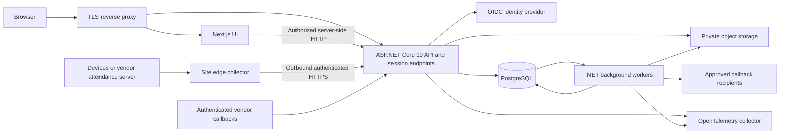
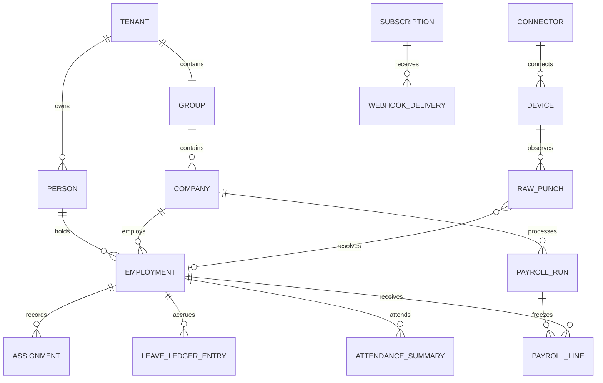

# HRMS Enterprise Product Context

Build a configurable, multi-tenant SaaS HRMS for independent business groups, with PostgreSQL, an ASP.NET Core 10 API, and a Next.js interface. Each group can operate multiple companies. Preserve the business workflows demonstrated in `Mockup`, while rebuilding persistence, authorization, calculations, integrations, and operations for production use. The first release must support the complete core employee-to-payroll lifecycle, healthcare credential tracking, recruitment, biometric attendance ingestion, and managed callbacks.

This document defines the product and architecture. [DEVELOPMENT_STEP.md](DEVELOPMENT_STEP.md) defines the delivery sequence and acceptance gates. Architecture choices below are recommendations; local findings describe the supplied files; external factual claims cite primary sources. Research baseline: 9 September 2026. Recheck dependencies, statutory rules, and device support before implementation and release.

## 1. Product boundaries and assumptions

The launch product is multi-tenant SaaS serving independent business groups. The initial industry/country configuration follows the Kenyan healthcare and insurance mockup, with multiple legal companies and sites, KES payroll, and `Africa/Nairobi` as the initial business time zone. Every customer group is a separate tenant from the first release. Deployment location, actual volumes, identity provider, biometric models, and bank formats remain decision items, not established facts.

An enterprise product here means reliable business outcomes: people see only authorized records; payroll can be reproduced; concurrent decisions cannot spend a leave balance twice; device outages do not silently lose punches; every important change is attributable; and recovery is demonstrated. A visually polished interface is part of this standard, together with accessible workflows and clear failure states.

Initial production scope includes all mockup modules, tenant onboarding and lifecycle management, the integrations workspace, and a controlled future-improvements workspace. Exclude patient records, clinical care management, insurance claims adjudication, direct movement of bank funds, and automated employment decisions. Additional countries require separately validated country packs. Launch supports operator-assigned plans and contractual/manual billing; self-service checkout, native mobile apps, performance management, and learning management are roadmap items.

### Terminology

| Term | Meaning |
|---|---|
| Tenant | An independently secured customer/business group; multiple tenants supported at launch |
| Group | The business group within that tenant; initially one group per tenant |
| Company | A legal employer, with its own payroll, settings, grants, and reporting |
| Site/location | A physical workplace; model its relationship to departments explicitly, since departments can span sites |
| Person | A stable identity within a tenant; not a globally shared identity across customers |
| Employment | A person's relationship with one legal employer, with effective-dated assignments |
| Connector | A configured integration instance with its own identity, scope, credentials, and capabilities |
| Raw punch | An observed device/clock event, before attendance interpretation |
| Callback/webhook | An authenticated machine notification, distinct from an interactive user approval |

## 2. Supplied application assessment

### 2.1 Inventory and evidence

| Artifact | Observed contents | Use in the rebuild |
|---|---|---|
| [Working application](../Mockup/app/hrms.html) | 7,356 lines; self-contained UI, browser business logic, seed data, and storage wrapper | Primary behavioral reference and screen inventory |
| [Readable source](../Mockup/src/) | 18 JavaScript files covering phases 2–5 | Domain-rule discovery; phase 1 is embedded in the HTML |
| [Database design](../Mockup/database/schema.prisma) | 54 Prisma models; PostgreSQL-oriented draft | Entity vocabulary and migration input, not the production migration |
| [README](../Mockup/README.md), [start guide](../Mockup/START-HERE.txt) | Workflow descriptions, demo personas, historical production proposal | Requirements evidence; some paths and architecture guidance are stale |
| [Employee CSV](../Mockup/templates/hrms_employee_import_template.csv) | 36 columns, including compensation and bank data; no company column | Versioned migration mapping; require explicit destination company |
| [Attendance CSV](../Mockup/templates/attendance_import_template.csv) | `Employee ID`, `Date`, `In`, `Out` | Legacy import adapter; insufficient as a raw device-event contract |
| [Test suites](../Mockup/tests/) | 11 Node/jsdom suites; README claims 150 checks; no package manifest/lockfile supplied | Characterization cases to port, not proof of production readiness |
| Supplied screenshots | Group dashboard, company selector, HR/recruitment/administration navigation | Visual direction and information-architecture reference |

The JavaScript storage wrapper uses `window.storage` when available and an in-memory `Map` otherwise. It is not a PostgreSQL application, nor does ordinary browser file opening guarantee persistence. Access rules run in the same browser that holds the data. The tests exercise a mocked browser environment; they were inspected, not executed during this documentation task.

Four split source files are not exact text matches inside the assembled HTML: `phase3-d.js`, `phase5-a.js`, `phase5-b.js`, and `phase5-f.js`. This establishes source drift, not the extent of functional divergence. Preserve the assembled application as the baseline and reconcile differences when extracting each workflow. The README's `hrms_group.html` and `prisma/schema.prisma` paths differ from the supplied layout.

### 2.2 Functional coverage and intended production behavior

| Capability / existing navigation | Production requirement | Release gate |
|---|---|---|
| Dashboard, Group dashboard, Management view | Role-specific KPIs, permitted-company consolidation, drill-down, metric definitions and freshness | G4, G12 |
| Employees, Add employee, My profile | Employee directory, sensitive-field separation, lifecycle history, attachments, self-service changes | G4 |
| Import employees | Mapping, preview, row errors, duplicate review, resumable execution and reconciliation | G4, G13 |
| Company settings, Organisation, Group & companies | Legal entities, divisions, departments, sites, jobs, grades, cost centres, effective dates | G2, G4 |
| Users, Roles & permissions | Multiple scoped roles, explicit grants, self/team/company/group permissions, SSO/MFA | G2 |
| Attendance | Rosters, raw punches, derived summaries, monthly register, corrections, approved overtime and locking | G7 |
| Leave, Leave & shifts | Effective policies, accrual ledger, calendars, balances, requests and cancellations | G6 |
| Approvals | Assigned steps, substitution, delegation, escalation and decision history | G5 |
| Payroll runs, Statutory rates | Company/pay-group runs, versioned calculation rules, reconciliation, approval and adjustments | G9 |
| My payslips | Authorized published payslips and accessible/printable downloads | G9 |
| Payroll exports | Bank files, statutory files, registers and balanced GL with versioned formats | G9 |
| Letters | Versioned templates, safe merge fields, preview, immutable issued document/reference | G10 |
| Documents | Secure files, verification, actual credential expiry, renewals, legal holds and retention | G10 |
| Recruitment, Requisitions, Vacancies, Candidates | Budgeted requisitions, vacancy lifecycle, applications, interviews, offers and conversion | G11 |
| Inter-company transfer | Effective transfer between employments, history preservation and payroll/leave settlement | G4, G9 |
| Reports | Governed metrics, as-of reporting, authorized exports, scheduled delivery | G12 |
| Audit log | Tenant/company-scoped, append-only business audit with protected archival | G2, G13 |
| New: SaaS tenant administration | Provisioning, invitations, lifecycle, plans/quotas, controlled support, export and offboarding | G2, G13 |
| Backup & restore | Operational recovery status and controlled restore workflow | G13 |
| New: Integrations → Biometric devices | Device inventory, adapters, mappings, health, sync, errors and reconciliation | G8 |
| New: Integrations → Callbacks & webhooks | Subscriptions, incoming endpoints, secrets, deliveries, retries and replay | G8 |
| New: Product → Improvements & releases | Feedback, roadmap, release notes and permission-controlled feature rollout | G12 |

Gate definitions are in [DEVELOPMENT_STEP.md](DEVELOPMENT_STEP.md). All rows are required before declaring full core scope complete; gates are not independent product editions.

### 2.3 Corrections required before production

| Finding from local code/schema | Consequence | Required correction |
|---|---|---|
| `PayrollRun.period` is globally unique and has no company field | Separate legal employers cannot have independent runs for the same period | Company/pay-group/period/run-kind/revision identity |
| `LeaveRequest`, `AttendanceRecord`, `PayrollRun`, `AuditLog`, and other models lack direct company ownership | The header's universal company-scoping claim is not implemented by the schema | Explicit ownership, composite foreign keys, query filters and row security |
| `CompanySetting` remains a singleton; several policy tables are global | Settings can unintentionally cross company boundaries | Scoped policy definitions with explicit inheritance and versions |
| User has one role; group access is a broad boolean | Insufficient control over role differences between companies | Scoped role assignments and separately auditable group grants |
| Accessors often derive historical visibility from an employee's current company | A transfer can change who sees prior payroll, leave or documents | Store historical ownership on transactions and reference employment |
| `AUDIT_CAP = 4000` truncates persisted audit history | Append-only UI does not provide durable long-term evidence | Append-only storage, archival, and approved retention |
| `computeRow` returns weekly off/holiday before evaluating punches | Worked weekends/holidays can disappear from attendance interpretation | Roster-aware work intervals, preserving observations regardless of classification |
| A missing clock-out becomes half a shift of work | Incomplete evidence can affect pay automatically | Attendance exception requiring resolution; no invented worked duration |
| One `In`/`Out` pair per employee/day | Breaks, split shifts, multiple devices and overnight shifts are underspecified | Raw event log and explicit work intervals/shift instances |
| NSSF seed uses 8,000/72,000 limits with a 2025 effective date | Incorrect contributions for later periods | Effective-dated country rules; see section 8 |
| Cash medical/airtime allowances are seeded non-taxable | Tax classification can be wrong merely because of a component label | Evidence-backed component treatment and employee eligibility |
| Maternity is represented as 90 days | Calendar months and a fixed day count can differ | Calendar-month entitlement representation; see section 8 |
| Financial calculations use JavaScript floating-point numbers | Rounding and reproducibility risks | C# `decimal`, PostgreSQL `numeric`, explicit rounding policy |
| Large documents are catalogued without file bytes | A listed document does not prove the file exists | Quarantined object storage and migration missing-file report |
| Document completeness does not treat all pending verification as a failure | An unverified licence may appear compliant | Only verified, current, applicable evidence satisfies mandatory credentials |
| Frontend approval functions are permission-based without a robust assigned-step engine | The same actor may advance multiple approval stages | Server workflow assignments and separation of duties |
| “Never delete” is used broadly | Indefinite retention conflicts with governed data lifecycle | Legal holds, retention schedules, approved erasure/anonymization |

Do not copy the mockup's Prisma/Node backend proposal: the target backend is ASP.NET Core 10 with EF Core/Npgsql. Keep the mockup unchanged as a reference; resolve incorrect behavior through documented acceptance cases.

## 3. Architecture decisions

### 3.1 Technology baseline

| Layer | Recommended baseline | Rationale and constraint |
|---|---|---|
| API/runtime | .NET 10 / ASP.NET Core 10, current supported patch | Required stack; .NET 10 is LTS through November 2028 [^1] |
| Data access | EF Core 10 and compatible Npgsql EF provider 10 | Single migration owner; native PostgreSQL integration [^2] |
| Database | PostgreSQL 18, current minor | Supported major; PostgreSQL 17 is a documented fallback if hosting/extensions require it [^3] |
| Web | Next.js 16 App Router, TypeScript, compatible React | Next.js 16 is Active LTS at research baseline; pin a patched release [^4] |
| Node runtime | Node.js 24 LTS, compatible with chosen Next.js release | Avoid the mockup's old Node 20 baseline; follow runtime support policy [^5] |
| UI | Tailwind CSS, owned shadcn/ui components, TanStack Table | Customizable shared components and headless grid behavior [^6][^7] |
| Browser state | Server rendering for initial authorized data; TanStack Query for interactive server state | One cache strategy per screen; URL state for shareable filters; no HR records in persistent browser storage |
| Forms | React Hook Form and Zod, with API validation authoritative | Responsive form feedback without duplicating business authority |
| Background work | .NET Worker with PostgreSQL durable jobs, inbox and outbox | Imports, payroll, expiry alerts and integrations survive restarts |
| Files | Private S3-compatible or cloud object storage | Database stores metadata, hashes, versions and access policy |
| Observability | OpenTelemetry traces, metrics and structured logs | Connect UI/API/worker/adapter failures using correlation IDs [^8] |
| Tests | xUnit, PostgreSQL integration tests, Playwright, accessibility checks, load tests | Verify actual database policies and browser workflows |

Exact patch versions belong in `global.json`, central NuGet package versions, package lockfiles, and pinned container images when implementation starts. Do not treat this document as a fixed package lock. Review library licences and vendor SDK redistribution terms before adoption.

### 3.2 Modular monolith with separate workers

Start with one horizontally scalable API service, one Next.js application, and independently deployable workers/edge collectors. Use shared PostgreSQL tables with mandatory tenant ownership and RLS for the initial SaaS tier; establish a tenant-to-database routing boundary so a dedicated database tier can be introduced when justified. Keep business modules separate in code and PostgreSQL schemas, with explicit interfaces. This allows transactions across closely related HR operations without distributed transaction complexity. Split a module into a separate service only when measured load, independent release needs, or security isolation justify it.



Next.js never connects to the HR database. Its server components fetch narrow API DTOs using the user's session. Browser requests use same-origin `/api/v1`; reverse proxy routes these to .NET. Domain permissions and calculations live in .NET. Next.js guidance explicitly supports external HTTP APIs and emphasizes minimizing data passed to client components. [^9]

### 3.3 Module ownership

| Module / schema | Owns | Publishes or consumes |
|---|---|---|
| Identity / `identity` | Users, grants, roles, sessions, service identities | Access changes, session revocation |
| SaaS / `saas` | Tenant lifecycle, provisioning, plan entitlements, quotas, support access and deletion jobs | Tenant activated/suspended/offboarded |
| Organization / `organization` | Tenant, group, companies, sites, departments and master data | Company/organization changes |
| People / `people` | Person, employment, assignments, salary terms, bank details, lifecycle | Employee and transfer events |
| Workflow / `workflow` | Versioned definitions, instances, assigned steps and decisions | Approval outcomes |
| Leave / `leave` | Policies, calendars, requests and balance ledger | Approved leave, reversals |
| Attendance / `attendance` | Rosters, punches, intervals, exceptions and period close | Approved attendance summaries |
| Payroll / `payroll` | Country rules, pay groups, input snapshots, runs, lines, exports | Payroll approved/published/settled |
| Recruitment / `recruitment` | Requisitions, vacancies, candidates, applications, interviews, offers | Candidate hired |
| Documents / `documents` | Files, verification, credential requirements, templates and letters | Expiry/verification events |
| Integrations / `integrations` | Connectors, devices, mapping, inbox/outbox, subscriptions and deliveries | Normalized external events |
| Reporting / `reporting` | Read models, saved views, metric definitions and report jobs | Consumes domain events |
| Product / `product` | Improvement requests, release notes, feature rollout configuration | Feature activation events |
| Audit / `audit` | Business audit and protected archival pointers | Receives attributable change records |

Other modules cannot update a module's tables directly. Cross-module reporting uses approved views/projections. A small shared kernel contains identifiers, clocks, result/error types and event contracts, not a generic repository framework for every domain.

## 4. Identity, tenancy and authorization

### 4.1 Session design

Use an established OIDC provider with authorization-code flow and PKCE. Enforce MFA for privileged roles. ASP.NET Core owns the authentication callback and issues a secure, HttpOnly, SameSite session cookie using a server-side ticket/session store. Share and protect .NET Data Protection keys across API replicas. Store external provider tokens only server-side where required. Cookie authentication requires deliberate session validation and revocation. [^10]

Use a proposed 30-minute idle timeout and 12-hour absolute lifetime, configurable by risk policy. Step up authentication for privilege changes, bank-detail changes, payroll approval and recovery operations. Revoke access promptly on deactivation or grant changes. For local-only deployments, select a maintained identity provider or ASP.NET Core Identity configuration through an ADR; never migrate demo accounts/passwords into production.

Unsafe cookie-authenticated requests require antiforgery tokens and origin validation; SameSite is a supplementary defense. The OIDC callback uses correlation/state/nonce protection. Device callbacks use machine authentication on separate endpoints, with no browser session fallback. [^11]

### 4.2 Authorization model

Effective access is the intersection of an authenticated identity, tenant membership, granted company scope, action permission, relationship scope, field classification, and workflow state. A route or company selector is never an authorization boundary.

| Persona | Default access |
|---|---|
| Platform operator | Infrastructure administration; no routine employee or salary access |
| Group administrator | Explicitly granted group administration; sensitive HR permissions assigned separately |
| Group HR | Granted companies; employee lifecycle and HR workflows; compensation only with permission |
| Company HR | One or more named companies; no implicit whole-group access |
| Payroll preparer | Compute and reconcile specified pay groups; cannot approve own run |
| Payroll approver | Review and approve, with maker/checker separation |
| Manager | Effective reporting relationships; approvals and attendance; restricted employee DTOs |
| Employee | Own permitted profile, requests, attendance, documents and published payslips |
| Auditor | Read-only, scoped audit/report access; sensitive details separately granted |
| Integration identity | Explicit connector, tenant, company, device and event scopes |

All-companies mode is a read aggregation over granted companies in the current tenant. A group-dashboard permission is required independently of the number of company grants. Company-scoped writes require one explicit permitted company. Tenant switching requires membership and changes the whole request context; a tenant ID from a request body cannot establish membership.

Enforce server-side projection of salary, bank, government identifiers, medical evidence, and candidate notes. Verify access for list/search/count/export/download/notification/dashboard paths, not only individual records. Return 404 for a record outside permitted ownership and 403 for a forbidden action on an otherwise visible resource.

### 4.3 Database defense

Use `TenantId` on tenant-owned rows, and `CompanyId` on company-owned rows, including historical transactions. Separate global reference catalogs from tenant-owned configuration. References between company-owned entities include matching tenant/company ownership in foreign keys. Person data shared across companies requires a separate authorized projection and a reason to share.

Apply EF query filters plus explicit write guards and PostgreSQL row-level security (RLS). RLS `USING` governs visibility and `WITH CHECK` governs permitted writes. Runtime accounts must not own protected tables or have superuser/`BYPASSRLS`; enable `FORCE ROW LEVEL SECURITY` where appropriate. Owners and privileged roles can otherwise bypass policies. [^12][^13]

For each database transaction, establish transaction-local tenant/actor/company context only after API authorization. Missing context denies access. Test context reset after rollback, exceptions and pooled-connection reuse. Workers use bounded service identities and explicit company contexts. Query filters do not secure raw SQL by themselves, and application-controlled RLS context is not protection against a fully compromised backend. Restrict SQL construction, database privileges and network paths as additional controls.

Sensitive search indexes, object keys, caches, job payloads and realtime subscriptions carry the same boundaries. Include tenant, permitted scope/version and relevant filters in cache keys. Start with no shared caching of private API results or HR pages; introduce caching only after isolation tests exist.

### 4.4 SaaS control plane and tenant lifecycle

The platform control plane is separate from tenant HR administration. A tenant administrator cannot create cross-tenant roles, change platform quotas, access another tenant's identifiers or restore a whole shared database. Platform operators see service and billing metadata by default, not employee records. Support access requires a tenant-approved, time-limited grant with reason, scoped permissions, visible session status and full audit; there is no permanent universal HR superuser.

Provisioning is an idempotent job: create tenant identity and storage namespace, select country/configuration template, assign plan/quotas, invite initial administrator, complete setup validation, then activate. States are Provisioning, Active, Suspended, Closing and Deleted, with explicit failure/retry handling. Suspension revokes interactive and machine access according to a documented contract while preserving records; distinguish security suspension from payment-related restriction. Never silently drop device data during a suspended period: return an explicit retryable or terminal status and provide backlog reconciliation on reactivation.

Resolve tenant membership from verified identity plus an explicit tenant selection. A subdomain or request header is a routing hint, not proof of authorization. Rate limits, upload limits, export concurrency, background-job quotas, device intake and callback delivery budgets apply per tenant as well as globally. Workers schedule fairly across tenants so a large import cannot starve another customer's payroll. Tenant-specific configuration and schemas are versioned without tenant-specific code forks.

Launch needs tenant-scoped data export, access revocation, retention/legal-hold review and auditable offboarding, including object files, vendor mappings and integration credentials. Deletion spans live data, caches, search/read models and backup-expiry handling. Production recovery drills must prove that recovering one tenant does not overwrite or expose another tenant. Subscription billing integration can follow later, but plan enforcement and a commercial account reference exist from launch.

## 5. PostgreSQL and domain model

### 5.1 Core aggregates



This is a conceptual diagram; unresolved punches remain valid intake records until mapping succeeds. Exact table layouts and ownership constraints are implementation deliverables.

| Area | Required additions/replacements |
|---|---|
| People | `Person`, `Employment`, `EmploymentAssignment`, `EmploymentStatusHistory`, `CompensationVersion`, `BankAccountVersion`, `TransferCase` |
| Access | `TenantMembership`, `UserRoleAssignment`, `RolePermission`, `CompanyGrant`, `ServicePrincipal`, `Session` |
| Leave | `LeavePolicyVersion`, `CalendarVersion`, `LeaveRequest`, `LeaveLedgerEntry`, reservation and adjustment references |
| Attendance | `Roster`, `ShiftTemplateVersion`, `ShiftInstance`, `RawPunch`, `WorkInterval`, `AttendanceSummaryVersion`, `AttendanceException`, `AttendancePeriodClose` |
| Payroll | `CountryRuleSet`, `PayGroup`, `PayrollRun`, `PayrollInputSnapshot`, `PayrollLine`, `PayrollLineComponent`, `PayrollAdjustment`, `PaymentBatch`, `ExportArtifact` |
| Recruitment | Separate `Candidate` from `Application`; one candidate can apply to multiple vacancies within authorized tenant context |
| Workflow | `WorkflowDefinitionVersion`, `WorkflowInstance`, `WorkflowStepInstance`, `ApprovalDecision`, `Delegation` |
| Files | `Document`, `DocumentVersion`, `DocumentRequirementVersion`, `Verification`, `LegalHold`, `RetentionAction`, `LetterTemplateVersion`, `IssuedLetter` |
| Integrations | `Connector`, `Device`, `DeviceEnrollmentMapping`, `SyncCursor`, `SyncRun`, `InboxMessage`, `OutboxMessage`, `WebhookSubscription`, `WebhookDelivery`, `DeliveryAttempt` |
| Product | `FeatureDefinition`, `FeatureAssignment`, `ImprovementRequest`, `ImprovementStatusHistory`, `ReleaseNote`, `UserPreference`, `SavedView` |
| SaaS | `TenantProvisioningJob`, `TenantLifecycleEvent`, `PlanAssignment`, `QuotaPolicy`, `UsageCounter`, `SupportAccessGrant`, `TenantExportJob`, `TenantDeletionJob` |

### 5.2 Invariants and data conventions

Use UUID identifiers; retain source identifiers separately for migration. Employee numbers are unique within legal employer, not across unrelated tenants. Use generated UUIDs and database sequences for business references; do not use record counts for the next payroll/letter/requisition number.

Use PostgreSQL `numeric` and C# `decimal` for money, rates and balances. A proposed money storage default is `numeric(19,4)`; publish currency amounts at their approved scale and retain intermediate precision. Encode monetary API values as decimal strings plus ISO currency; browser totals are display previews only. Prevent invalid ranges and unsupported currencies at the API and database levels.

Use UTC `timestamptz` for instants, `date` for business dates, and a separately stored IANA time zone for sites and policies. Preserve device-local timestamp, offset if present, and ingestion time. `timestamptz` alone does not retain the source time-zone name. Effective periods use half-open intervals `[from, to)` consistently. Prevent overlapping primary assignments and incompatible policy versions with constraints or transactional checks.

Payroll uniqueness is `(tenant, company, payGroup, periodStart, periodEnd, runKind, revision)`, with additional rules preventing competing active regular runs. Approved versions are immutable. Salary, bank and employment changes are effective-dated. A transfer closes the source employment/assignment and opens the destination relationship while preserving the person link; prior payroll remains owned by the source employer.

Attendance summaries reference the workday's employment and shift instance, not only the employee's current assignment. Device user mappings are effective-dated because badge IDs can be reused. A group-owned physical device can serve multiple companies through explicit mappings; the incoming payload cannot choose the destination company.

Use optimistic concurrency tokens on editable aggregates and `ETag`/`If-Match` in update contracts. Use database transactions/locks where concurrent changes affect balances, slot counts, approvals, payroll publication and numbering. Retry only operations proven idempotent.

### 5.3 Performance and lifecycle

Start with composite indexes driven by actual queries: employee directory by tenant/company/status/name; attendance by tenant/company/work-date/employment; raw punches by connector/device/source identity and observed time; payroll by company/period/status; workflow inbox by assignee/status/due date. Use bounded pagination and authorized server-side search. Add PostgreSQL trigram/full-text search only after confirming matching requirements and indexes.

At 2,000 staff and an assumed four punches per day over 365 days, raw intake is approximately 2.92 million events/year; daily summaries are about 730,000/year. At 10,000 staff these become 14.6 million and 3.65 million. These are sizing assumptions, not measured workload. Plan partitioning for raw events/audit only when measured volume, retention or maintenance warrants it. If partitioning changes uniqueness enforcement, retain a separate non-partitioned deduplication ledger so duplicate prevention remains global over the required window.

Retain immutable business evidence for its approved period, then apply legal holds and governed purge/anonymization. Never cascade-delete payroll, issued letters or audit when deactivating a person. Record deletion manifests so restored backups can reapply approved erasures.

## 6. API and asynchronous processing

REST APIs use `/api/v1`, generated OpenAPI, explicit request/response DTOs and standard Problem Details errors with stable error codes and trace IDs. ASP.NET Core provides first-party OpenAPI generation; generate and verify the TypeScript client against the API contract in CI. [^14]

| Contract area | Representative routes |
|---|---|
| Session and access | `/api/v1/session`, `/api/v1/me/permissions`, `/api/v1/companies` |
| People | `/api/v1/employees`, `/employees/{id}`, `/employments/{id}/transfers` |
| Imports and jobs | `/api/v1/imports`, `/imports/{id}/validate`, `/imports/{id}/commit`, `/jobs/{id}` |
| Time and leave | `/api/v1/leave/requests`, `/leave/balances`, `/attendance/punches`, `/attendance/periods/{id}/close` |
| Approvals | `/api/v1/approvals/inbox`, `/approvals/{stepId}/decisions` |
| Payroll | `/api/v1/payroll/runs`, `/runs/{id}/compute`, `/runs/{id}/approve`, `/runs/{id}/exports` under the payroll prefix |
| Recruitment | `/api/v1/requisitions`, `/vacancies`, `/candidates`, `/applications`, `/offers/{id}/convert` |
| Documents | `/api/v1/documents/upload-sessions`, `/documents/{id}/complete-upload`, `/documents/{id}/download` |
| Integrations | `/api/v1/integrations/connectors`, `/devices`, `/sync-runs`, `/webhook-subscriptions` under the integrations prefix |
| External ingestion | `/api/v1/integrations/ingestion/{connectorId}/punch-batches`, `/api/v1/integrations/callbacks/{connectorId}` |
| Improvements | `/api/v1/improvements`, `/api/v1/releases`, `/api/v1/features/effective` |

Routes are proposed contracts, not existing endpoints. Fully specify them in OpenAPI before building clients. Use `201` for created resources, `202` plus authorized job URL for asynchronous requests, `409` for invalid state/idempotency conflict, `412` for stale updates, `422` for business validation, and `429` with bounded retry advice for rate limits. Authenticate job polling, errors and downloaded artifacts as carefully as source data.

Scope idempotency keys to tenant, company, principal and operation, with a request hash and recorded outcome. A matching retry returns the original result; key reuse with different content fails. Unique business constraints remain the final defense after the key expires. Idempotency is mandatory for payroll computation/publication, import commit, candidate conversion, device intake and callback-driven actions.

Persist a domain change and its outbox event in one transaction. Workers claim jobs with leases, recover expired leases, record attempts and apply backoff. External consumers receive at-least-once delivery; they deduplicate. Long payroll calculations use immutable input snapshots and durable chunks, followed by atomic finalization into a publishable run. Process memory and fire-and-forget tasks are not durable queues.

Approval definitions are versioned. Resolve assignees when a workflow starts, record substitutions explicitly, prohibit self-approval on sensitive workflows, and permit a decision only for the active step. A role grant alone is not an assignment. An incoming callback may record an external status; it cannot bypass an HR or payroll approval.

## 7. UX and dynamic interface specification

### 7.1 Navigation and visual direction

Retain the screenshot's dark navigation, light workspace, clear company context and teal accent as the initial brand direction. Improve hierarchy and density with a collapsible sidebar, grouped navigation, breadcrumbs, a persistent search/command control and a personal work inbox. Avoid the screenshot's oversized empty chart panels and clipped long company labels; size content to information and expose full labels accessibly.

Navigation groups: **Home**, **People**, **Time & Leave**, **Payroll**, **Recruitment**, **Documents**, **Reports**, **Integrations**, **Administration**, and **Product**. Keep My workspace available for employee tasks. Show only authorized navigation; direct URLs still require server enforcement. Company switching clears stale queries and selections, cancels obsolete requests, revalidates drafts and resets incompatible filters.

Use a coherent token system: surface/background/text/border/semantic colors, a 4px spacing scale, consistent typography, compact and comfortable density, 40–44px normal controls, and clear focus styles. Prefer semantic status icons and text alongside color. Validate contrast in both light and dark themes before shipping; dark mode is optional until complete. Use responsive layouts at 360, 768, 1280 and 1920px, with controlled horizontal scrolling only for genuinely wide registers.

### 7.2 Shared interaction patterns

| Pattern | Required behavior |
|---|---|
| Data tables | Server pagination/filter/sort, selected-column persistence, saved views, sticky headings and clear result counts |
| Bulk actions | Explicit scope and selected count, preview, permission checks per record, asynchronous progress and downloadable error report |
| Forms | Sectioned layout, labels/help, inline errors plus error summary, draft handling, unsaved-change protection and conflict recovery |
| Dashboards | Clickable KPIs, reporting date/window, comparison period, authorized drill-down and last-refreshed timestamp |
| Charts | Real scaling, full labels/tooltips, zero-data state, accessible table alternative and no inference from hidden salary data |
| Side panels | Quick profile/request review; large workflows use dedicated routes rather than nested modals |
| Approval inbox | Assigned-to-me, delegated, overdue and completed views; evidence and decision history beside the action |
| Background jobs | Progress, counts, failures, cancellation eligibility and safe retry; toast is not the only record |
| Notifications | Per-user read state, permission recheck on open, minimal sensitive detail and a durable inbox |
| Empty/error states | Distinguish no records, no results, inaccessible content, delayed synchronization and unavailable service |
| Accessibility | WCAG 2.2 AA target, keyboard completion, focus management, screen-reader labels, reduced motion, accessible validation |

WCAG 2.2 adds criteria relevant to this product, including unobscured focus, alternatives to dragging and accessible authentication. A recruitment kanban must therefore also support keyboard/menu-based stage movement. Automated checks alone do not establish conformance. [^15]

### 7.3 Priority screens

The group dashboard shows active headcount as of a date, joiners/exits in an explicit interval, outstanding approvals, payroll status per company, credential risks and device health. Define active headcount separately from “all records including exits.” Never sum different currencies without an explicit presentation currency, exchange-rate source and date; until then, group costs remain separated by currency. Show approved payroll costs separately from draft estimates.

Employee 360 uses an identity header and tabs for Overview, Employment, Compensation, Attendance, Leave, Documents, Payslips and History. Tabs and fields use API-provided capabilities. Sensitive record edits show effective date, reason, validation and workflow status. A former employer's records do not become visible to the destination employer merely because an employee transferred.

Payroll is a guided workspace: period/company → input readiness → compute → compare exceptions → reconcile → submit → approve → publish/export → settlement. Show control totals and blocking issues before approval. Exported bank files do not mean payment has occurred.

### 7.4 What “dynamic” means

Support approved custom fields, company policy settings, saved views, dashboard preferences, workflow definitions, notification rules and feature flags. Store typed definitions with validation, ownership, effective dates, field classification, export behavior and schema version. Index frequently queried custom fields deliberately. Do not turn core payroll/employment models into untyped JSON records.

Custom forms use a fixed safe component registry. Configuration cannot inject arbitrary JavaScript, SQL, HTML, network calls or executable payroll code. Policy changes require simulation, review, publication and an effective date. Running workflows and approved payroll retain their versions. Tenant branding may change logos/accent tokens within contrast constraints.

## 8. Payroll, leave and healthcare policy

### 8.1 Verified research implications

| Topic | Primary-source finding | Product implication |
|---|---|---|
| NSSF | Year 4 notice is effective February 2026: lower earnings limit KES 9,000; upper KES 108,000; maximum employee Tier I 540 and Tier II 5,940, total 6,480, matched by employer [^16] | Preserve earlier versions; the mockup's 8,000/72,000 seed must not be used for these periods |
| PAYE | KRA publishes bands from 10% to 35%, resident personal relief of KES 2,400/month, allowable deductions and qualifying insurance relief [^17] | Model residency, eligibility and evidence; do not apply the same relief to everyone |
| Cash allowances | KRA's taxable-employment-income guidance includes cash payments/allowances [^17] | Component names such as medical or airtime do not establish exemption |
| SHIF | The published 2024 regulations specify 2.75% of gross salary/wage for salaried households, with a KES 300 minimum [^18] | Effective-dated contribution base and rules; validate applicable amendments before release |
| Housing levy | KRA describes 1.5% employee and 1.5% employer contributions, and AHL/SHIF deductions in taxable-pay computation [^17] | Separate employee deductions, employer costs and taxable-pay treatment |
| Leave | Employment Act sections 28–30 cover annual, maternity, paternity and sick leave; maternity wording is three months [^19] | Policies need units, eligibility and calendar semantics, not only a numeric day allowance |
| Biometrics | ODPC's final 2025 guidance covers lawful processing, data minimization, local serving-copy requirements, DPIA and breach response [^20] | Complete the privacy workstream before live biometric processing |

These findings identify implementation requirements and known seed defects, not a complete tax/legal certification. Maintain the legal source, effective date, approved interpretation, reviewer and test fixtures for every country rule. Track later Acts, regulations, notices, court decisions and collective agreements. Do not treat a fixed seven-year retention period or a 26-day divisor as universally applicable merely because it appears in the mockup.

The final ODPC guidance, rather than the earlier draft, states a full up-to-date serving copy of biometric data should be in Kenya and that the DPIA is submitted at least 60 days before processing. Have the privacy lead confirm applicability to the actual device/vendor/HRMS flows, including cross-border processing. Store biometric templates on approved devices/vendor systems by default; this does not remove governance duties for those systems. [^20]

### 8.2 Calculation and control requirements

Country packs define earning/contribution bases, brackets, caps, exemptions, reliefs, employer liabilities, rounding and export schemas. Keep inputs effective-dated and approved. Pay components need classifications for cash/non-cash, taxable/non-taxable and each statutory base; “gross” is not assumed to mean the same base for every contribution.

Calculation input snapshots include employment eligibility, pay components, approved overtime, unpaid/half-pay leave, allowances, loans, arrears, deductions, bank details, rule versions and calculation-engine version. Test joiners/leavers, partial periods, off-cycle runs, negative/zero net, benefits in kind, pension caps, statutory boundaries, rounding and multiple employments. Eligibility-heavy cases unsupported by the first engine must block affected payroll, not silently approximate.

Payroll states: Draft → Computing → Computed → In review → Approved → Published → Partially settled/Settled, with explicit Failed, Rejected and Cancelled paths. Approval freezes the calculation. Correction creates a linked adjustment or superseding draft before approval; it never edits an approved payslip. Published payslips use the frozen identity/company/template snapshot. Preserve period totals and year-to-date accumulation needed by statutory reports.

Reconcile employee line totals against run totals, net against payment batches, and GL debit/credit totals. Explain every difference from the previous period. Bank export formats are bank-specific and versioned; payment references and settlement confirmations are separate records. Require two successful parallel payroll cycles against independently reviewed reference results before cutover.

Leave uses a ledger for opening balances, accrual, reservation, approved consumption, cancellation/reversal, carry-forward, expiry and manual adjustment. Reserve pending requests consistently, prevent overlap, and recompute under the same policy/calendar version. A concurrent approval cannot overspend the same balance. Healthcare calendars follow assigned rosters, not a universal Saturday/Sunday weekend. Missing punches, disputed overtime and expired credentials create reviewable exceptions; they do not automatically justify pay deductions or disciplinary action.

Credential requirements vary by role, jurisdiction and regulator. Record the credential's actual issuer, registration number, expiry and verification evidence. A default validity period is a suggestion, not proof of legal validity. Flag expired clinical credentials prominently and allow policy-controlled rostering restrictions with accountable resolution.

## 9. Biometric device integration workspace

### 9.1 Integration options and evidence limits

| Option | Appropriate use | Constraints / evidence |
|---|---|---|
| Vendor server API | Existing ZKBio Time or BioStar deployment | Prefer when it avoids competing connections and provides history; validate licence, API version and pagination |
| Vendor push/listening protocol | Device/server can send events to a collector | Authentication and acknowledgment vary; direct public exposure is not assumed |
| Device SDK through edge collector | Local network devices requiring native/proprietary SDKs | Validate OS/CPU/runtime support; isolate legacy Windows SDKs from the Linux API |
| Scheduled polling | Reliable historical query API, no durable push | Persist cursor plus overlap window, deduplicate, reconcile counts |
| CSV upload | Initial migration or operational fallback | Versioned mapping and provenance; cannot restore events never exported |

ZKTeco advertises a ZKBio Time API for ERP/HR integration, but its API manual download is member-gated. This supports evaluating a vendor-server adapter, not promising a universal ZKTeco protocol or endpoint. [^21]

Suprema documents BioStar local APIs, a separate time-and-attendance API, and WebSocket monitoring. Its guidance distinguishes realtime monitoring from delayed database-backed queries; use historical backfill alongside any live stream. Avoid assuming simultaneous direct device control and vendor-server control is supported. [^22][^23][^24]

Hikvision publishes time-and-attendance integration options involving ISAPI and SDKs; detailed resources can require partner access and licence agreements. Exact event structures, listening modes and firmware compatibility need a hardware proof of concept. [^25]

No brand/model is certified by this plan. The first supported adapter is selected after device inventory. Record vendor, model, serial, firmware, protocol version, licensed middleware, SDK licence, collector OS, supported commands, encryption, event identifiers, retention capacity and observed behavior in a compatibility matrix.

### 9.2 Screens and actions

**Integrations → Biometric devices** contains Overview, Devices, Employee mapping, Live events, Sync history, Exceptions, and Settings. Device details show company/site ownership, vendor/model, firmware, last heartbeat, last event, cursor, backlog, clock skew, certificate/credential expiry and adapter version. Do not label a device “healthy” merely because it recently answered a ping.

The add-connector wizard chooses a supported adapter, ownership, connection method, time zone and secret reference; tests connectivity; validates capabilities; maps a small employee set; previews normalized events; then enables synchronization. Present only capabilities supported by that adapter.

Actions include test connection, synchronize a bounded date range, pause/resume, rotate credentials, resolve mappings and replay quarantined records after correction. Record actor, reason, selected scope and job outcome. Employee provisioning/deprovisioning is a later capability unless explicitly included in the selected pilot; disabling HR access must not depend on successful device synchronization. No generic remote command, door-unlock or biometric-template export control belongs in the initial HRMS UI.

### 9.3 Intake contract and processing

```json
{
  "schemaVersion": "1.0",
  "batchId": "batch_opaque_id",
  "events": [{
    "sourceEventId": "device_generation_4:982311",
    "deviceId": "registered_device_id",
    "deviceUserId": "000123",
    "occurredAt": "2026-09-09T05:03:21Z",
    "localTimestamp": "2026-09-09T08:03:21",
    "timeZone": "Africa/Nairobi",
    "direction": "in",
    "verificationMethod": "fingerprint",
    "sourceSequence": "982311"
  }]
}
```

This is the HRMS normalized contract, not a vendor payload. Connector credentials establish tenant and allowed devices/companies. The API generates receipt time, stores provenance and returns per-event accepted/duplicate/quarantined/rejected outcomes after durable persistence. Unknown employee mappings are accepted into quarantine, not discarded. Normalize only after authenticating the producer and validating request limits.

Deduplicate on stable connector/device/event identity, accounting for device resets and event-ID reuse through a generation identifier. When no stable ID exists, the adapter defines and tests a fingerprint using available sequence/time/type/user fields. Timestamp-only deduplication can collapse legitimate punches; uncertain collisions require review. Preserve duplicate-attempt metrics without counting duplicates as work.

The collector has an encrypted local spool, disk-capacity alarms, retry/backoff and acknowledged cursors. Size it for a proposed seven-day outage at measured peak volume. It advances the cursor only after durable central acknowledgment; one failed mapping must not cause an entire batch to loop forever. Catch-up must overlap the prior window and reconcile counts. Validate reboot, full buffer, sequence rollover, disconnection, clock change and delayed/out-of-order delivery.

Match punches to the effective employment mapping and roster. Build work intervals before daily summaries, preserving break and split-shift semantics. Night-shift workday ownership is a policy decision. Unknown direction, implausible duration, skew and unmatched punches become exceptions. Changes after attendance close require reopening or an approved adjustment; they never silently recalculate approved payroll.

Raw event fields and minimized vendor evidence are retained under policy, with restricted access and encryption. The HRMS does not collect fingerprint images, face templates or biometric embeddings in this design. Vendor-origin payloads containing those fields must be rejected or sanitized before normal persistence.

## 10. Callbacks and webhooks workspace

### 10.1 Direction and permissions

Provide **Integrations → Callbacks & webhooks**, with Incoming endpoints, Outgoing subscriptions, Event catalog, Deliveries, and Secrets. Incoming device/vendor callbacks, outgoing HR business events and OIDC login callbacks are separate concerns with separate authentication paths.

Subscription setup selects an approved HTTPS destination, company scope, permitted event types and secret; displays a redacted sample; sends a synthetic test; and records activation. Permissions distinguish integration administration, delivery viewing, secret rotation and replay. A user's ability to administer a connector does not grant that connector salary access.

Initial event catalog: `employee.created.v1`, `employment.changed.v1`, `leave.approved.v1`, `attendance.exception.created.v1`, `payroll.approved.v1`, `document.expiring.v1`, and `candidate.hired.v1`. Payloads are minimal references and state metadata; salary/bank/document contents require explicit separate data contracts and grants. Recheck subscription scope at dispatch, including after access revocation.

### 10.2 Delivery contract

```json
{
  "id": "evt_opaque_id",
  "type": "leave.approved.v1",
  "occurredAt": "2026-09-09T10:00:00Z",
  "tenantId": "tenant_opaque_id",
  "companyId": "company_opaque_id",
  "subject": "leave-requests/request_opaque_id",
  "aggregateVersion": 4,
  "data": { "requestId": "request_opaque_id", "status": "approved" }
}
```

Use Standard Webhooks signing conventions: `webhook-id`, `webhook-timestamp`, and `webhook-signature`; HMAC-SHA256 over the message ID, timestamp and exact raw body, with the specified separators and encoding. Verify using constant-time comparison and a bounded timestamp tolerance. Retain deduplication history separately from timestamp validation. Key rotation supports overlapping active keys. Use the specification directly when implementing the signer/verifier. [^26]

Proposed service policy: ten-second delivery timeout; first attempt immediately, then retry at 1 minute, 5 minutes, 30 minutes, 2 hours, 6 hours, 12 hours and 24 hours, with jitter and bounded `Retry-After` handling. Retry network failures, 408, 429 and 5xx; treat other 4xx as configuration/permanent failures, and pause on 410. Successful 2xx means the receiver accepted responsibility. Receivers must persist before acknowledging.

Delivery is at least once, with no global ordering promise. Keep the same event ID and body across retries; use a fresh signing timestamp per attempt. Track delivery ID, attempt number and aggregate version separately. Manual replay requires permission/reason, preserves the original event ID, and is audited; receivers should continue deduplicating. If an operator needs a new business event, create it through an explicit domain operation.

Dead-lettered deliveries show destination, event type, timestamps, HTTP status, next action and redacted error. Store only bounded, sanitized response excerpts, never auth headers or unrestricted response bodies. Proposed delivery metadata retention is 90 days, subject to approved policy. Keep the integration event/inbox deduplication record for the maximum configured retry/replay window; behavior outside that window must be explicit.

### 10.3 Security and reliability

Outgoing URLs are a server-side request-forgery boundary. Allow HTTPS on approved ports, disallow redirects and userinfo, validate DNS/address results at connection time, and block loopback, link-local, private/reserved ranges and metadata services through application and network egress controls. Handle IPv6 and DNS rebinding. Private customer endpoints require a separately configured private connector with explicit destinations, not a global bypass. [^27]

Incoming callbacks verify the vendor's documented signature/mTLS/authentication scheme on raw bytes. An unguessable URL, supplied serial number or IP allowlist alone is insufficient proof of identity. Legacy unauthenticated device protocols terminate only inside the controlled site network; the collector authenticates to HRMS. Impose payload, batch, rate and queue limits. Store a durable inbox before acknowledging and process asynchronously.

Partition worker capacity and circuit breakers by connector/subscription so one failing recipient cannot stall payroll or other companies. UI realtime updates carry minimal invalidation events through authorized channels; HTTP queries remain authoritative. A webhook reports a completed state change and cannot veto the database transaction that already committed it.

## 11. Documents, audit and operations

Uploads follow authorize → short-lived upload session → quarantine → validate type/size/checksum → malware scan → publish immutable object version. A file is unavailable until accepted. Downloads recheck scope and produce short-lived access or authenticated streaming. Prevent active HTML/script execution, untrusted template evaluation and spreadsheet formula injection in exported text fields. Record missing file bytes during mockup migration explicitly.

Audit business changes in the same transaction as the change where feasible, capturing tenant/company, actor/service identity, action, entity/version, time, reason, workflow/correlation ID and redacted changes. Restrict updates/deletes for application roles. Protect archival copies from ordinary administrators. Hash chains can add tamper evidence but are not a substitute for protected storage, permissions or retention controls.

Deploy API, UI, workers and collectors with separate identities and least privilege. Keep database and object storage private, terminate TLS appropriately, use a managed secret store, and rotate keys. Provide separate development, test, staging and production environments. Development seeds are synthetic; production starts without demo users or generated employees.

Use infrastructure as code, immutable artifacts, reviewed migration bundles, readiness/liveness probes and rollback procedures. Do not run uncontrolled schema migrations on every API replica startup. Use expand/migrate/contract changes so old and new application versions coexist during deployment. Roll back application images only while schema compatibility remains valid.

PostgreSQL recovery requires tested base backups and continuous WAL archiving/PITR, not just nightly logical dumps. Replication is availability, not a substitute for backups. Restore exercises must include database, object versions, encryption keys, configuration and integration cursors; suspend outgoing notifications/payment exports during recovery until reconciled. [^28]

The Backup & restore UI exposes backup freshness, last successful restore drill, and authorized recovery requests. Infrastructure recovery is an operational workflow with scope/evidence and approval, not a browser button accepting a production database replacement. Shared-tenant restore requires isolated recovery and scoped data extraction rather than overwriting other tenants.

### Proposed service targets

These are acceptance targets to validate with measured infrastructure, not current capabilities or contractual SLAs.

| Measure | Initial target and test condition |
|---|---|
| Availability | 99.9% monthly service availability, with measurement/exclusions agreed before contract |
| Interactive APIs | p95 ≤500 ms for ordinary scoped reads, ≤1 second for ordinary writes under the agreed load |
| UI | p75 LCP ≤2.5 seconds, INP ≤200 ms, CLS ≤0.1 on representative devices/network |
| Payroll | 2,000 employees computed/reconciled within five minutes on documented test infrastructure |
| Device ingestion | Sustain 100 events/second for 15 minutes, including duplicates, with zero lost acknowledged events |
| Event latency | p95 ≤60 seconds from central receipt to visible normalized event when mapping exists and queues are healthy |
| Recovery | Proposed RPO ≤15 minutes; RTO ≤4 hours, demonstrated through a full restore drill |
| Load baseline | Primary tenant: 2,000 employees, 200 active sessions, 40 requests/second; shared deployment: at least 10 tenants/20,000 total employees with competing jobs; 10,000-person tenant tested before claiming that tier |
| Accessibility | WCAG 2.2 AA target on primary end-to-end journeys with automated and manual evidence |

Track API failure/latency, database pool saturation, slow queries, payroll failure, oldest queued work, callback failure, unmapped punches, device backlog/clock drift, file scan delays, backup freshness and restore success. Alert owners need an actionable runbook and thresholds. Avoid high-cardinality employee identifiers or PII in telemetry labels.

## 12. Future improvement window

Ship a real **Product → Improvements & releases** workspace. Users can submit an improvement with module, problem, business impact, optional sanitized attachment and visibility. Product owners triage through Submitted → Under review → Planned → In progress → Released, or Declined with reason. Company-specific requests remain scoped; tenant-wide sharing is explicit. Release notes connect delivered improvements to their release and migration impact.

Feature management is separate from voting or roadmap status. Use a catalog of known capabilities and server-controlled assignments by tenant/company, with owner, default-off state, prerequisites, rollout dates, expiry/review date, kill switch and audit. The effective feature set returned to the UI is already authorized. Enabling a flag cannot bypass permissions or make an incomplete payroll rule applicable to historical runs.

| Horizon | Candidate improvements | Prerequisites |
|---|---|---|
| After core stabilization | Onboarding/offboarding task packs, assets, probation reminders, more bank/ERP adapters | Workflow, People, documents and integrations stable |
| Workforce expansion | Advanced rostering, shift swaps, on-call/locum scheduling, mobile self-service | Reliable attendance and effective policies |
| Broader HR suite | Performance reviews, goals, training, expenses, benefits and grievance cases | Privacy boundaries and separate domain ownership |
| Regional expansion | Additional country payroll packs, translations and multi-currency reporting | Country validation, FX policies and reconciliation |
| SaaS commercial expansion | Self-service checkout, metered billing, custom domains and dedicated database tiers | Launch tenant lifecycle/quotas/recovery proven; payment/provider contracts selected |
| Assisted workflows | Policy search, drafting and explainable suggestions | Permission-aware retrieval, human review and data-processing controls |

Do not introduce AI-based candidate rejection, medical inference, hidden employee scoring or automatic disciplinary decisions as an incidental extension. Each capability needs an explicit product case and review. Preserve future options with module contracts and events rather than a runtime marketplace for arbitrary untrusted code.

## 13. Decision register and completion boundary

| Open decision | Planning default | Required resolution |
|---|---|---|
| Deployment model | Confirmed: multi-tenant SaaS for independent business groups | Mandatory launch requirement; implementation must preserve tenant isolation |
| Deployment region/provider | Private network and protected storage; no cloud vendor committed | Operations/privacy before infrastructure procurement |
| Device fleet | Vendor-neutral adapter boundary; no model promised | Integration lead before device pilot |
| Identity provider | OIDC with privileged MFA | Security/IT during foundation |
| Volumes/sites/concurrency | Targets in section 11 | Operations before capacity acceptance |
| Payroll rules, CBAs and exports | Kenya pack with effective versions | Payroll/HR/legal before live calculations |
| Retention and biometric governance | Minimize data; approved record-class schedules | Privacy/legal before migration and live pilot |
| UI brand and terminology | Screenshot palette, compact enterprise workspace | Product/design during UI acceptance |
| Funding/team/release dates | Gate-based plan, no unvalidated completion date | Delivery owner after discovery |

Documentation completion does not mean the application has been rebuilt. At this baseline, no production API, Next.js application, EF migration, deployment, device certification or payroll certification exists in this repository. The next authorized implementation should follow the gates in [DEVELOPMENT_STEP.md](DEVELOPMENT_STEP.md), preserving these ownership, financial and integration invariants.

## Sources

Primary sources below were consulted for the research baseline. Living documentation should be checked again at implementation. Undated pages are identified as such; a page's retrieval date is not its publication date. Local evidence is linked in section 2.

[^1]: Microsoft, [.NET Support Policy](https://dotnet.microsoft.com/en-us/platform/support/policy), updated August 2026. Runtime/API/EF support lifecycle. Use the current policy when dates differ from an older release announcement.
[^2]: Npgsql project, [EF provider 10.0 release notes](https://www.npgsql.org/efcore/release-notes/10.0.html), version 10.0. EF Core/PostgreSQL compatibility and JSON support.
[^3]: PostgreSQL Global Development Group, [Versioning Policy](https://www.postgresql.org/support/versioning/), living policy. Supported majors and upgrade lifecycle.
[^4]: Vercel, [Next.js Support Policy](https://nextjs.org/support-policy), living policy. Next.js 16 Active LTS status.
[^5]: Node.js project, [Node.js Releases](https://nodejs.org/en/about/previous-releases), living release table. Supported runtime selection.
[^6]: shadcn/ui, [Introduction](https://ui.shadcn.com/docs), undated living documentation. Ownership/customization of component source.
[^7]: TanStack, [Table Overview](https://tanstack.com/table/latest/docs/overview), undated living documentation. Headless grid approach.
[^8]: OpenTelemetry, [.NET Getting Started](https://opentelemetry.io/docs/languages/dotnet/getting-started/), updated August 2025. .NET telemetry integration.
[^9]: Vercel, [Data Security in Next.js](https://nextjs.org/docs/app/guides/data-security), updated August 2026. External HTTP API boundary and safe DTOs.
[^10]: Microsoft Learn, [Cookie authentication in ASP.NET Core](https://learn.microsoft.com/en-us/aspnet/core/security/authentication/cookie?view=aspnetcore-10.0), .NET 10 documentation. Sessions, cookie protection and validation.
[^11]: OWASP, [Cross-Site Request Forgery Prevention Cheat Sheet](https://cheatsheetseries.owasp.org/cheatsheets/Cross-Site_Request_Forgery_Prevention_Cheat_Sheet.html), living guidance. Cookie-authenticated request protection.
[^12]: Microsoft Learn, [Global Query Filters](https://learn.microsoft.com/en-us/ef/core/querying/filters), living EF Core documentation. Tenant filtering and bypass limitations.
[^13]: PostgreSQL Global Development Group, [Row Security Policies](https://www.postgresql.org/docs/18/ddl-rowsecurity.html), PostgreSQL 18 documentation. RLS semantics and privileged bypass.
[^14]: Microsoft Learn, [Overview of OpenAPI support](https://learn.microsoft.com/en-us/aspnet/core/fundamentals/openapi/overview?view=aspnetcore-10.0), .NET 10 documentation. Contract generation.
[^15]: W3C, [Web Content Accessibility Guidelines 2.2](https://www.w3.org/TR/WCAG22/), Recommendation; and [What's New in WCAG 2.2](https://www.w3.org/WAI/standards-guidelines/wcag/new-in-22/). Accessibility acceptance criteria.
[^16]: NSSF Kenya, [Notice to Employers — Year 4 (2026) Contribution Rates](https://www.nssf.or.ke/notice-to-employers-year-4-2026-nssf-contribution-rates), posted 18 February 2026; [official notice image](https://www.nssf.or.ke/wp-content/uploads/2026/02/Notice.png), visually inspected. Effective February 2026 tier limits/contributions.
[^17]: Kenya Revenue Authority, [Pay As You Earn](https://www.kra.go.ke/individual/filing-paying/types-of-taxes/paye) and [More about PAYE](https://www.kra.go.ke/helping-tax-payers/faqs/more-about-paye), living guidance. Taxable income, bands, deductions, reliefs and employer levy treatment.
[^18]: Kenya Ministry of Health, [Social Health Insurance (General) Regulations, 2024](https://health.go.ke/sites/default/files/2024-11/Social%20Health%20Insurance%20%28General%29%20Regulations%2C%202024_0.pdf), 2024 text hosted November 2024. Salaried-household contribution rule; confirm subsequent amendments at release.
[^19]: Kenya Law, [Employment Act, 2007](https://new.kenyalaw.org/akn/ke/act/2007/11/eng%402023-07-01), accessed consolidated version dated 1 July 2023, sections 28–30. Leave foundations; later amendments and applicable employment terms require review.
[^20]: Office of the Data Protection Commissioner, [Guidance Notes on Biometric Data](https://www.odpc.go.ke/wp-content/uploads/2025/11/ODPC-%E2%80%93-Guidance-Note-on-Biometric-Data.pdf), final 2025 guidance, particularly pages 32–34. Transfer, localization, DPIA and incident implications; earlier draft excluded as authority.
[^21]: ZKTeco, [ZKBio Time API](https://www.zkteco.com/en/ZKBioTime_API/ZKBioTime_API), undated product page; lists API manual updated November 2024, download gated. Integration availability, not device certification.
[^22]: Suprema, [How to use BioStar 2 New Local API](https://support.supremainc.com/en/support/solutions/articles/24000047041--biostar-2-api-how-to-use-and-start-biostar-2-new-local-api), updated 17 June 2025; [TA API introduction](https://support.supremainc.com/en/support/solutions/articles/24000073529--biostar-2-ta-api-how-to-use-and-start-biostar-2-ta-api), updated 9 June 2025. API/version distinctions.
[^23]: Suprema, [Realtime event logs through WebSocket](https://support.supremainc.com/en/support/solutions/articles/24000022040--biostar-2-how-to-get-the-real-time-event-logs-through-web-socket-method), updated 18 May 2026. Live monitoring versus database query delay.
[^24]: Suprema, [SDK/API integration practices](https://support.supremainc.com/en/support/solutions/articles/24000056658-best-practices-biostar-2-device-sdk-g-sdk-and-biostar-2-api), historical guidance; [event-search pagination](https://support.supremainc.com/en/support/solutions/articles/24000106474--biostar-2-api-how-to-implement-pagination-for-event-search), updated 11 August 2026. Connection ownership and historical retrieval constraints; recheck on target version.
[^25]: Hikvision, [Time & Attendance integration](https://tpp.hikvision.com/solutions/TimeAttendance-Integration), [Getting Started Center](https://tpp.hikvision.com/tpp/GettingStartedCenter), and [TPP FAQs](https://tpp.hikvision.com/Support/FAQs), living partner documentation. ISAPI/SDK options and gated technical/licensing resources.
[^26]: Standard Webhooks project, [Specification](https://github.com/standard-webhooks/standard-webhooks/blob/main/spec/standard-webhooks.md), living specification. Signature headers, signed bytes, verification and rotation conventions; retry schedule in this document is a product choice.
[^27]: OWASP, [Server-Side Request Forgery Prevention Cheat Sheet](https://cheatsheetseries.owasp.org/cheatsheets/Server_Side_Request_Forgery_Prevention_Cheat_Sheet.html), living guidance. Destination validation and network controls.
[^28]: PostgreSQL Global Development Group, [Continuous Archiving and Point-in-Time Recovery](https://www.postgresql.org/docs/18/continuous-archiving.html), PostgreSQL 18 documentation. WAL/base-backup recovery approach.
