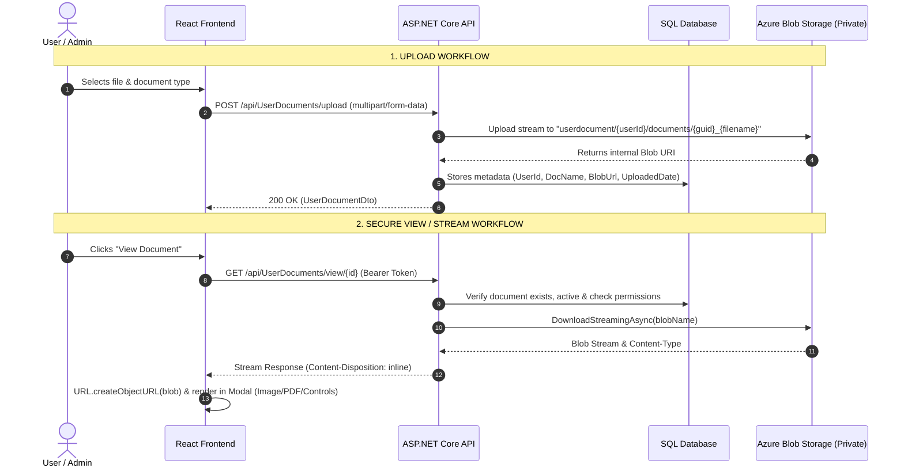

# Azure Blob Storage & Secure Document Management Blueprint
> **Project Reference:** `StarSHATopUp` (Backend: ASP.NET Core Web API | Frontend: Next.js / React / TypeScript / Tailwind CSS)  
> **Purpose:** A complete, production-grade guide to implement secure file uploads, private blob storage, custom backend streaming URLs (instead of public blob URLs), and an interactive document preview modal with zoom, rotate, download, and print capabilities.

---

## Table of Contents
1. [Overview & Core Architecture](#overview--core-architecture)
2. [Section A: Backend Implementation (.NET Core)](#section-a-backend-implementation-net-core)
   - [1. Storage Container Security & Configuration](#1-storage-container-security--configuration)
   - [2. Azure Blob Virtual Folder Structure](#2-azure-blob-virtual-folder-structure)
   - [3. Backend Project File Structure](#3-backend-project-file-structure)
   - [4. Step-by-Step Code Flow: Uploading Documents](#4-step-by-step-code-flow-uploading-documents)
   - [5. Serving Documents via Custom URLs (Stream, Not Direct Blob)](#5-serving-documents-via-custom-urls-stream-not-direct-blob)
3. [Section B: Frontend Implementation (Next.js / React)](#section-b-frontend-implementation-nextjs--react)
   - [1. Frontend Project File Structure](#1-frontend-project-file-structure)
   - [2. Document Upload Component (Drawer / Form)](#2-document-upload-component-drawer--form)
   - [3. Advanced Document Viewer Modal (View, Zoom, Rotate, Download, Print)](#3-advanced-document-viewer-modal-view-zoom-rotate-download-print)
4. [Section C: Production Checklist & Gotchas](#section-c-production-checklist--gotchas)

---

## Overview & Core Architecture

In this architecture:
1. **Azure Blob Storage is Strictly Private (`PublicAccessType.None`)**: Blobs cannot be accessed directly by anonymous clients or public URLs.
2. **Virtual Folder Paths**: Blobs are organized by entity ID, request ID, or module name using forward slashes (`/`), which creates a clear hierarchy in Azure Storage.
3. **Custom Backend Streaming Endpoints (Custom URLs)**: Instead of handing out raw Azure Blob URLs or temporary SAS tokens to users:
   - Preview: `GET /api/UserDocuments/view/{id}`
   - Download: `GET /api/UserDocuments/download/{id}`
   The backend validates permissions, streams the file from Azure via `blobClient.DownloadStreamingAsync()`, sets the proper `Content-Type` and `Content-Disposition` headers (`inline` vs `attachment`), and strips any internal GUID prefixes.
4. **Interactive Frontend Modal**: The frontend calls the view endpoint with the user's `Bearer` authorization token, converts the stream into an in-memory `blob:` object (`URL.createObjectURL`), detects the MIME type (PDF vs. Image vs. Office doc), and provides zoom, rotate, download, print, and approval/rejection controls.



---

## Section A: Backend Implementation (.NET Core)

### 1. Storage Container Security & Configuration

#### NuGet Packages Required
Add `Azure.Storage.Blobs` to your Infrastructure project:
```xml
<PackageReference Include="Azure.Storage.Blobs" Version="12.27.0" />
```

#### `appsettings.json`
Configure the Azure Storage connection string and container name:
```json
{
  "AzureBlob": {
    "ConnectionString": "DefaultEndpointsProtocol=https;AccountName=<your_storage_account>;AccountKey=<your_account_key>;EndpointSuffix=core.windows.net",
    "ContainerName": "starinsurance-documents"
  }
}
```

#### Service Registration (`Program.cs`)
Register the blob service as a scoped dependency:
```csharp
builder.Services.AddScoped<IBlobStorageService, AzureBlobStorageService>();
builder.Services.AddScoped<IUserDocumentService, UserDocumentService>();
```

---

### 2. Azure Blob Virtual Folder Structure

Azure Blob Storage uses a flat hierarchy with a key-value structure. By including `/` in blob names, Azure Storage Explorer and blob APIs treat them as virtual directory paths.

In `StarSHATopUp`, the following hierarchical paths are enforced:

| Document Category | Virtual Folder Path Pattern | Example |
| :--- | :--- | :--- |
| **User Documents** | `userdocument/{userId}/documents/{guid}_{fileName}` | `userdocument/usr_99182/documents/e4b9..._passport.pdf` |
| **Document Requests** | `ShaDocuments/{memberId}/{requestId}/{guid}_{fileName}` | `ShaDocuments/mem_1024/req_88/a10f..._medical_bills.jpg` |
| **Member Records** | `ShaMembers/{memberId}/{guid}_{fileName}` | `ShaMembers/mem_1024/7c3d..._discharge_summary.pdf` |
| **Policy PDFs** | `policies/{guid}_{fileName}` | `policies/4f82..._policy_contract_2026.pdf` |

#### Why this structure is critical:
- **No filename collisions:** Prefixing each file with `{Guid.NewGuid()}_` ensures two users uploading `receipt.pdf` never overwrite each other.
- **Tenant & Entity Isolation:** Easy to delete or audit all files belonging to a specific user or request.
- **Container Level Security:** The container is initialized with `PublicAccessType.None`, disabling anonymous public read access.

---

### 3. Backend Project File Structure

```text
StarShaPlusApi/
├── StarInsurance.Domain/
│   └── Entities/
│       └── UserDocument.cs               # Entity mapping metadata to DB table
├── StarInsurance.Application/
│   ├── DTO/
│   │   └── UserDocumentDtos.cs           # Upload, View, and Review DTOs
│   └── Interfaces/
│       ├── IBlobStorageService.cs        # Low-level Azure blob contracts
│       └── IUserDocumentService.cs       # High-level domain document contracts
├── StarInsurance.Infrastructure/
│   └── Repositories/
│       ├── AzureBlobStorageService.cs    # Azure SDK implementation (Upload/Download)
│       └── UserDocumentService.cs        # Business logic & DB persistence
└── StarInsurance/ (Web API)
    ├── Controllers/
    │   └── UserDocumentsController.cs    # Upload, View (inline), and Download endpoints
    └── Program.cs                        # DI setup & Middleware
```

---

### 4. Step-by-Step Code Flow: Uploading Documents

#### Step 4.1: Low-Level Storage Interface (`IBlobStorageService.cs`)
```csharp
using Microsoft.AspNetCore.Http;
using System.IO;
using System.Threading.Tasks;

namespace StarInsurance.Application.Interfaces
{
    public interface IBlobStorageService
    {
        Task<string> UploadAsync(IFormFile file, string folder);
        Task<(Stream Stream, string ContentType, string FileName)?> DownloadAsync(string blobUrlOrPath);
    }
}
```

#### Step 4.2: Azure Blob Implementation (`AzureBlobStorageService.cs`)
```csharp
using Azure.Storage.Blobs;
using Azure.Storage.Blobs.Models;
using Microsoft.AspNetCore.Http;
using Microsoft.Extensions.Configuration;
using StarInsurance.Application.Interfaces;
using System;
using System.IO;
using System.Threading.Tasks;

namespace StarInsurance.Infrastructure.Repositories
{
    public class AzureBlobStorageService : IBlobStorageService
    {
        private readonly BlobContainerClient _container;

        public AzureBlobStorageService(IConfiguration config)
        {
            var connection = config["AzureBlob:ConnectionString"];
            var containerName = config["AzureBlob:ContainerName"];

            _container = new BlobContainerClient(connection, containerName);
            // Ensure container exists with zero public access
            _container.CreateIfNotExists(PublicAccessType.None);
        }

        public async Task<string> UploadAsync(IFormFile file, string folder)
        {
            // Build the virtual directory path with GUID prefix to prevent name collisions
            var blobName = $"{folder}/{Guid.NewGuid()}_{file.FileName}";
            var blob = _container.GetBlobClient(blobName);

            using var stream = file.OpenReadStream();
            await blob.UploadAsync(stream, overwrite: true);

            // Returns internal blob URI (stored in database)
            return blob.Uri.ToString();
        }

        public async Task<(Stream Stream, string ContentType, string FileName)?> DownloadAsync(string blobUrlOrPath)
        {
            if (string.IsNullOrEmpty(blobUrlOrPath)) return null;

            string blobName;
            if (Uri.TryCreate(blobUrlOrPath, UriKind.Absolute, out var uri))
            {
                var path = uri.AbsolutePath.TrimStart('/');
                var containerName = _container.Name;
                if (path.StartsWith(containerName + "/", StringComparison.OrdinalIgnoreCase))
                {
                    blobName = path.Substring(containerName.Length + 1);
                }
                else
                {
                    blobName = path;
                }
            }
            else
            {
                blobName = blobUrlOrPath.TrimStart('/');
            }

            blobName = Uri.UnescapeDataString(blobName);
            var blobClient = _container.GetBlobClient(blobName);

            if (!await blobClient.ExistsAsync())
            {
                return null;
            }

            var properties = await blobClient.GetPropertiesAsync();
            var contentType = properties.Value.ContentType;
            var fileName = Path.GetFileName(blobName);

            // Strip the internal GUID prefix so the user sees their clean original filename
            if (fileName.Contains('_'))
            {
                var parts = fileName.Split('_', 2);
                if (Guid.TryParse(parts[0], out _))
                {
                    fileName = parts[1];
                }
            }

            // Fallback content-type detection if blob stored as generic octet-stream
            if (string.IsNullOrEmpty(contentType) || contentType == "application/octet-stream")
            {
                contentType = GetContentType(fileName);
            }

            var download = await blobClient.DownloadStreamingAsync();
            return (download.Value.Content, contentType, fileName);
        }

        private static string GetContentType(string fileName)
        {
            var ext = Path.GetExtension(fileName).ToLowerInvariant();
            return ext switch
            {
                ".pdf" => "application/pdf",
                ".png" => "image/png",
                ".jpg" or ".jpeg" => "image/jpeg",
                ".gif" => "image/gif",
                ".webp" => "image/webp",
                ".svg" => "image/svg+xml",
                ".doc" => "application/msword",
                ".docx" => "application/vnd.openxmlformats-officedocument.wordprocessingml.document",
                _ => "application/octet-stream"
            };
        }
    }
}
```

#### Step 4.3: Database Entity (`UserDocument.cs`)
```csharp
using System;
using System.ComponentModel.DataAnnotations;
using System.ComponentModel.DataAnnotations.Schema;

namespace StarInsurance.Domain.Entities
{
    [Table("userDocuments")]
    public class UserDocument
    {
        [Key]
        public int Id { get; set; }

        [Required]
        [MaxLength(450)]
        public string UserId { get; set; } = string.Empty;

        [Required]
        [MaxLength(255)]
        public string DocName { get; set; } = string.Empty;

        [Required]
        public string Url { get; set; } = string.Empty; // Holds internal blob URI

        public DateTime UploadedDate { get; set; } = DateTime.UtcNow;

        [MaxLength(450)]
        public string? UploadedBy { get; set; }

        [MaxLength(100)]
        public string? DocumentType { get; set; }

        public bool IsActive { get; set; } = true;
        public bool IsDeleted { get; set; } = false;
        public bool? IsVerified { get; set; }
        public string? Remarks { get; set; }
    }
}
```

#### Step 4.4: DTOs (`UserDocumentDtos.cs`)
```csharp
using System;
using Microsoft.AspNetCore.Http;

namespace StarInsurance.Application.DTO
{
    public class UploadUserDocumentDto
    {
        public string? UserId { get; set; } // If null, defaults to current authenticated user
        public string? DocName { get; set; }
        public string? DocumentType { get; set; }
        public required IFormFile File { get; set; }
    }

    public class UserDocumentDto
    {
        public int Id { get; set; }
        public string UserId { get; set; } = string.Empty;
        public string DocName { get; set; } = string.Empty;
        public string Url { get; set; } = string.Empty;
        public DateTime UploadedDate { get; set; }
        public string UploadedBy { get; set; } = string.Empty;
        public string DocumentType { get; set; } = string.Empty;
        public bool IsActive { get; set; }
        public bool? IsVerified { get; set; }
        public string? Remarks { get; set; }
    }
}
```

#### Step 4.5: Service Orchestration (`UserDocumentService.cs`)
```csharp
public async Task<UserDocumentDto> UploadUserDocumentAsync(UploadUserDocumentDto uploadDto, string uploaderId)
{
    var targetUserId = uploadDto.UserId ?? uploaderId;
    var fileName = uploadDto.DocName ?? uploadDto.File.FileName;

    // Structured folder path
    var folder = $"userdocument/{targetUserId}/documents";
    
    // Upload stream to Azure Blob
    var url = await _blobStorage.UploadAsync(uploadDto.File, folder);

    // Save record to DB
    var userDoc = new UserDocument
    {
        UserId = targetUserId,
        DocName = fileName,
        Url = url,
        UploadedDate = DateTime.UtcNow,
        UploadedBy = uploaderId,
        DocumentType = uploadDto.DocumentType,
        IsActive = true,
        IsDeleted = false,
        IsVerified = null, // Pending review
        Remarks = null
    };

    _context.UserDocuments.Add(userDoc);
    await _context.SaveChangesAsync();

    return new UserDocumentDto
    {
        Id = userDoc.Id,
        UserId = userDoc.UserId,
        DocName = userDoc.DocName,
        Url = userDoc.Url,
        UploadedDate = userDoc.UploadedDate,
        UploadedBy = userDoc.UploadedBy ?? string.Empty,
        DocumentType = userDoc.DocumentType ?? string.Empty,
        IsActive = userDoc.IsActive,
        IsVerified = userDoc.IsVerified,
        Remarks = userDoc.Remarks
    };
}
```

#### Step 4.6: Controller Upload Action (`UserDocumentsController.cs`)
```csharp
[HttpPost("upload")]
public async Task<IActionResult> UploadDocument([FromForm] UploadUserDocumentDto uploadDto)
{
    var userId = User.FindFirstValue(ClaimTypes.NameIdentifier);
    if (string.IsNullOrEmpty(userId)) return Unauthorized();

    try
    {
        var result = await _userDocumentService.UploadUserDocumentAsync(uploadDto, userId);
        return Ok(result);
    }
    catch (System.Exception ex)
    {
        return BadRequest(new { message = ex.Message });
    }
}
```

---

### 5. Serving Documents via Custom URLs (Stream, Not Direct Blob)

#### Why NOT direct Azure Blob URLs?
1. **Security & Privacy:** The Azure container is private. Direct URLs return `403 Forbidden` unless SAS tokens are generated.
2. **Access Control:** A direct link cannot check if the user is logged in, has the right role, or if the document was soft-deleted (`IsDeleted = true`).
3. **Infrastructure Shielding:** Client browsers never learn the name of your Azure Storage Account or internal file hierarchy.
4. **Header Control:** The server explicitly controls `Content-Disposition: inline` (for in-browser viewing) or `attachment` (for download).

#### Stream Resolution in Service (`UserDocumentService.cs`)
```csharp
public async Task<(Stream Stream, string ContentType, string FileName)?> GetDocumentStreamAsync(int id)
{
    var doc = await _context.UserDocuments.FindAsync(id);
    if (doc == null || string.IsNullOrEmpty(doc.Url) || doc.IsDeleted)
    {
        return null;
    }

    var downloadResult = await _blobStorage.DownloadAsync(doc.Url);
    if (downloadResult == null)
    {
        return null;
    }

    var result = downloadResult.Value;
    var fileName = !string.IsNullOrWhiteSpace(doc.DocName) ? doc.DocName : result.FileName;

    // Ensure proper file extension is retained
    var ext = System.IO.Path.GetExtension(result.FileName);
    if (!string.IsNullOrEmpty(ext) && !fileName.EndsWith(ext, StringComparison.OrdinalIgnoreCase))
    {
        fileName += ext;
    }

    return (result.Stream, result.ContentType, fileName);
}
```

#### Controller Custom Endpoints (`UserDocumentsController.cs`)
```csharp
// 1. VIEW ENDPOINT (Renders in browser / modal)
[HttpGet("view/{id}")]
[AllowAnonymous] // Can also be protected by [Authorize] or custom token if desired
public async Task<IActionResult> ViewDocument(int id)
{
    var docResult = await _userDocumentService.GetDocumentStreamAsync(id);
    if (docResult == null)
    {
        return NotFound("Document file not found");
    }

    var result = docResult.Value;
    
    // Setting "inline" instructs browsers to view the file rather than force download
    Response.Headers["Content-Disposition"] = $"inline; filename=\"{System.Uri.EscapeDataString(result.FileName)}\"";
    return File(result.Stream, result.ContentType);
}

// 2. DOWNLOAD ENDPOINT (Forces save dialog)
[HttpGet("download/{id}")]
[AllowAnonymous]
public async Task<IActionResult> DownloadDocument(int id)
{
    var docResult = await _userDocumentService.GetDocumentStreamAsync(id);
    if (docResult == null)
    {
        return NotFound("Document file not found");
    }

    var result = docResult.Value;
    
    // ASP.NET Core File() with 3 arguments automatically sets Content-Disposition: attachment
    return File(result.Stream, result.ContentType, result.FileName);
}
```

---

## Section B: Frontend Implementation (Next.js / React)

### 1. Frontend Project File Structure

```text
StarShaPlus/src/
├── lib/
│   └── api.ts                             # Axios instance with Bearer token interceptor
├── components/
│   ├── Drawers/
│   │   └── DocumentUploadDrawer.tsx       # Reusable upload drawer with drag-and-drop
│   └── admin/
│       ├── DocumentReviewTab.tsx          # Table / list of documents
│       └── DocumentViewerModal.tsx        # High-feature viewer modal (Zoom, Rotate, Print, Download)
```

---

### 2. Document Upload Component (Drawer / Form)

The upload drawer handles:
- Selecting document type from a dropdown.
- File selection with drag-and-drop support.
- File type and size validation.
- Sending `multipart/form-data` with an authenticated Axios instance.

```tsx
// src/components/Drawers/DocumentUploadDrawer.tsx
"use client";

import React, { useState, useEffect, useRef } from "react";
import { X, Upload, Loader2, CheckCircle, AlertCircle } from "lucide-react";
import api from "@/lib/api";
import Swal from "sweetalert2";

interface DocumentUploadDrawerProps {
  isOpen: boolean;
  onClose: () => void;
  onUploadSuccess: () => void;
}

export default function DocumentUploadDrawer({
  isOpen,
  onClose,
  onUploadSuccess,
}: DocumentUploadDrawerProps) {
  const [loading, setLoading] = useState(false);
  const [uploading, setUploading] = useState(false);
  const [selectedDocType, setSelectedDocType] = useState("");
  const [selectedFile, setSelectedFile] = useState<File | null>(null);
  const fileInputRef = useRef<HTMLInputElement>(null);

  const docTypes = ["National ID", "Passport", "Driving License", "Medical Report", "Other"];

  const handleFileChange = (e: React.ChangeEvent<HTMLInputElement>) => {
    if (e.target.files && e.target.files[0]) {
      const file = e.target.files[0];
      if (file.size > 10 * 1024 * 1024) {
        Swal.fire("File Too Large", "Max file size is 10MB.", "warning");
        return;
      }
      setSelectedFile(file);
    }
  };

  const handleUpload = async (e: React.FormEvent) => {
    e.preventDefault();
    if (!selectedFile || !selectedDocType) {
      Swal.fire("Error", "Please select a document type and a file.", "error");
      return;
    }

    setUploading(true);
    const formData = new FormData();
    formData.append("File", selectedFile);
    formData.append("DocName", selectedFile.name);
    formData.append("DocumentType", selectedDocType);

    try {
      await api.post("/userdocuments/upload", formData, {
        headers: { "Content-Type": "multipart/form-data" },
      });
      Swal.fire("Success", "Document uploaded successfully!", "success");
      onUploadSuccess();
      onClose();
      setSelectedFile(null);
      setSelectedDocType("");
    } catch (error: any) {
      console.error("Upload error", error);
      Swal.fire("Error", error.response?.data?.message || "Failed to upload document.", "error");
    } finally {
      setUploading(false);
    }
  };

  if (!isOpen) return null;

  return (
    <div className="fixed inset-0 z-[110] flex justify-end overflow-hidden">
      <div className="fixed inset-0 bg-gray-900/60 backdrop-blur-sm transition-opacity" onClick={onClose} />
      <div className="fixed inset-y-0 right-0 w-[420px] max-w-full bg-white shadow-2xl flex flex-col z-10 animate-in slide-in-from-right duration-300">
        <div className="flex items-center justify-between px-6 py-5 border-b">
          <h2 className="text-lg font-bold text-gray-900 flex items-center gap-2">
            <Upload size={20} className="text-blue-600" /> Upload Document
          </h2>
          <button onClick={onClose} className="p-1.5 rounded-full hover:bg-gray-100 text-gray-400">
            <X size={20} />
          </button>
        </div>

        <form onSubmit={handleUpload} className="flex-1 overflow-y-auto p-6 space-y-6">
          <div>
            <label className="block text-xs font-bold text-gray-700 uppercase mb-2">Document Type</label>
            <select
              value={selectedDocType}
              onChange={(e) => setSelectedDocType(e.target.value)}
              className="w-full px-4 py-3 rounded-xl border border-gray-200 text-sm focus:outline-none focus:ring-2 focus:ring-blue-500"
              required
            >
              <option value="">Select type</option>
              {docTypes.map((t) => (
                <option key={t} value={t}>{t}</option>
              ))}
            </select>
          </div>

          <div>
            <label className="block text-xs font-bold text-gray-700 uppercase mb-2">Select File</label>
            <div
              onClick={() => fileInputRef.current?.click()}
              className={`border-2 border-dashed rounded-2xl p-6 text-center cursor-pointer transition-all ${
                selectedFile ? "border-blue-500 bg-blue-50/20" : "border-gray-200 hover:border-blue-400"
              }`}
            >
              <input
                type="file"
                ref={fileInputRef}
                className="hidden"
                onChange={handleFileChange}
                accept=".pdf,.doc,.docx,.jpg,.jpeg,.png,.webp"
              />
              {selectedFile ? (
                <div className="flex flex-col items-center">
                  <CheckCircle size={32} className="text-green-500 mb-2" />
                  <p className="text-sm font-semibold text-gray-800">{selectedFile.name}</p>
                  <p className="text-xs text-gray-400">{(selectedFile.size / 1024 / 1024).toFixed(2)} MB</p>
                </div>
              ) : (
                <div className="flex flex-col items-center">
                  <Upload size={32} className="text-gray-400 mb-2" />
                  <p className="text-sm font-medium text-gray-700">Click or drag file here</p>
                  <p className="text-xs text-gray-400 mt-1">PDF, PNG, JPG (Max 10MB)</p>
                </div>
              )}
            </div>
          </div>
        </form>

        <div className="p-4 border-t bg-gray-50 flex justify-end gap-3">
          <button type="button" onClick={onClose} className="px-5 py-2.5 rounded-xl text-xs font-bold text-gray-600 hover:bg-gray-200">
            Cancel
          </button>
          <button
            onClick={handleUpload}
            disabled={uploading || !selectedFile || !selectedDocType}
            className="flex items-center gap-2 px-6 py-2.5 bg-blue-600 text-white rounded-xl text-xs font-bold hover:bg-blue-700 disabled:opacity-50"
          >
            {uploading ? <Loader2 size={16} className="animate-spin" /> : <Upload size={16} />}
            Upload Now
          </button>
        </div>
      </div>
    </div>
  );
}
```

---

### 3. Advanced Document Viewer Modal (View, Zoom, Rotate, Download, Print)

#### Why Fetch via `api.get(..., { responseType: 'blob' })`?
When an endpoint is secured with an `Authorization: Bearer <token>` header, placing `` or `<iframe src="https://api/view/1">` in HTML will fail because standard HTML tags **do not include custom HTTP headers**.

**Solution:**
1. Fetch the document stream through Axios with `responseType: "blob"`.
2. Generate a local blob URL: `URL.createObjectURL(response.data)`.
3. Feed the local `blob:` URL to the `` or `<iframe>`.
4. Clean up memory using `URL.revokeObjectURL(...)` when the modal closes.

#### Complete Component Code (`DocumentViewerModal.tsx`)
```tsx
// src/components/admin/DocumentViewerModal.tsx
"use client";

import React, { useState, useEffect } from "react";
import api from "@/lib/api";
import {
  X,
  Eye,
  Download,
  Printer,
  ExternalLink,
  ZoomIn,
  ZoomOut,
  RotateCw,
  RefreshCw,
  FileText,
  CheckCircle,
  XCircle,
  Calendar,
  User,
  AlertTriangle,
  Loader2,
} from "lucide-react";

export interface DocumentViewerModalProps {
  isOpen: boolean;
  onClose: () => void;
  document: {
    id: number;
    documentName: string;
    memberName?: string;
    dependantName?: string | null;
    status: string;
    requestedAt?: string;
    uploadedAt?: string | null;
    uploadedFileUrl: string | null;
    notes?: string | null;
    rejectionReason?: string | null;
  } | null;
  onApprove?: (id: number, notes?: string) => Promise<void> | void;
  onReject?: (
    id: number,
    reason: string,
    notes?: string,
  ) => Promise<void> | void;
}

export default function DocumentViewerModal({
  isOpen,
  onClose,
  document,
  onApprove,
  onReject,
}: DocumentViewerModalProps) {
  const [zoom, setZoom] = useState(1);
  const [rotation, setRotation] = useState(0);
  const [actionType, setActionType] = useState<"none" | "approve" | "reject">("none");
  const [reviewNotes, setReviewNotes] = useState("");
  const [rejectionReason, setRejectionReason] = useState("");
  const [submitting, setSubmitting] = useState(false);

  // In-Memory Blob State
  const [loadingFile, setLoadingFile] = useState(false);
  const [fileBlobUrl, setFileBlobUrl] = useState<string | null>(null);
  const [detectedType, setDetectedType] = useState<"image" | "pdf" | "other" | null>(null);

  const apiBase = process.env.NEXT_PUBLIC_API_URL || "https://localhost:5000/api";
  const streamViewUrl = document?.id ? `${apiBase}/UserDocuments/view/${document.id}` : "";
  const streamDownloadUrl = document?.id ? `${apiBase}/UserDocuments/download/${document.id}` : "";

  // 1. Fetch document stream when modal opens
  useEffect(() => {
    if (!isOpen || !document || !document.uploadedFileUrl) {
      setFileBlobUrl(null);
      setDetectedType(null);
      setLoadingFile(false);
      setZoom(1);
      setRotation(0);
      return;
    }

    let active = true;
    let localBlobUrl: string | null = null;

    const loadDocumentBlob = async () => {
      try {
        setLoadingFile(true);

        // Fetch securely with Bearer token
        const res = await api.get(`/UserDocuments/view/${document.id}`, {
          responseType: "blob",
        });

        if (!active) return;

        const contentType = (res.headers["content-type"] || res.data.type || "").toLowerCase();
        const cleanFileUrl = (document.uploadedFileUrl || "").split("?")[0].toLowerCase();

        let type: "image" | "pdf" | "other" = "other";
        if (contentType.includes("image") || /\.(jpeg|jpg|png|gif|webp|bmp|svg)$/i.test(cleanFileUrl)) {
          type = "image";
        } else if (contentType.includes("pdf") || /\.pdf$/i.test(cleanFileUrl)) {
          type = "pdf";
        }

        setDetectedType(type);

        // Create browser-accessible object URL
        const objectUrl = URL.createObjectURL(res.data);
        localBlobUrl = objectUrl;
        setFileBlobUrl(objectUrl);
      } catch (err: any) {
        console.warn("Failed to load stream, fallback to direct URL:", err);
        if (!active) return;
        setFileBlobUrl(document.uploadedFileUrl);
      } finally {
        if (active) setLoadingFile(false);
      }
    };

    loadDocumentBlob();

    // Cleanup: Prevent memory leaks
    return () => {
      active = false;
      if (localBlobUrl && localBlobUrl.startsWith("blob:")) {
        URL.revokeObjectURL(localBlobUrl);
      }
    };
  }, [isOpen, document?.id, document?.uploadedFileUrl]);

  if (!isOpen || !document) return null;

  // View Transformation Controls
  const handleZoomIn = () => setZoom((prev) => Math.min(prev + 0.25, 3));
  const handleZoomOut = () => setZoom((prev) => Math.max(prev - 0.25, 0.5));
  const handleRotate = () => setRotation((prev) => (prev + 90) % 360);
  const handleReset = () => {
    setZoom(1);
    setRotation(0);
  };

  // Open in New Browser Tab
  const handleOpenTab = () => {
    const targetUrl = fileBlobUrl || streamViewUrl || document.uploadedFileUrl;
    if (targetUrl) window.open(targetUrl, "_blank");
  };

  // Download Trigger
  const handleDownload = () => {
    if (streamDownloadUrl) {
      window.open(streamDownloadUrl, "_blank");
    } else if (fileBlobUrl) {
      const a = window.document.createElement("a");
      a.href = fileBlobUrl;
      a.download = document.documentName || "document";
      a.click();
    }
  };

  // Dedicated Print Action
  const handlePrint = () => {
    if (detectedType === "pdf" && fileBlobUrl) {
      // Create hidden iframe to trigger PDF print dialog
      const iframe = window.document.createElement("iframe");
      iframe.style.position = "fixed";
      iframe.style.bottom = "0";
      iframe.style.right = "0";
      iframe.style.width = "0";
      iframe.style.height = "0";
      iframe.style.border = "none";
      iframe.src = fileBlobUrl;
      window.document.body.appendChild(iframe);
      iframe.onload = () => {
        iframe.contentWindow?.focus();
        iframe.contentWindow?.print();
        setTimeout(() => window.document.body.removeChild(iframe), 3000);
      };
    } else if (detectedType === "image" && fileBlobUrl) {
      // Print image via printable popup
      const printWin = window.open("", "_blank");
      if (printWin) {
        printWin.document.write(`
          <html>
            <head><title>${document.documentName}</title></head>
            <body style="margin:0;display:flex;align-items:center;justify-content:center;">
              
            </body>
          </html>
        `);
        printWin.document.close();
      }
    } else {
      handleOpenTab();
    }
  };

  const handleApprove = async () => {
    if (!onApprove) return;
    try {
      setSubmitting(true);
      await onApprove(document.id, reviewNotes);
      setActionType("none");
      setReviewNotes("");
    } finally {
      setSubmitting(false);
    }
  };

  const handleReject = async () => {
    if (!onReject) return;
    if (!rejectionReason.trim()) {
      alert("Please provide a rejection reason.");
      return;
    }
    try {
      setSubmitting(true);
      await onReject(document.id, rejectionReason, reviewNotes);
      setActionType("none");
      setRejectionReason("");
      setReviewNotes("");
    } finally {
      setSubmitting(false);
    }
  };

  const hasFile = Boolean(document.uploadedFileUrl);

  return (
    <div className="fixed inset-0 z-50 flex items-center justify-center bg-black/70 backdrop-blur-sm p-4 overflow-y-auto animate-in fade-in duration-200">
      <div className="bg-white rounded-2xl shadow-2xl w-full max-w-5xl max-h-[92vh] flex flex-col overflow-hidden border border-gray-200">
        
        {/* 1. MODAL HEADER */}
        <div className="bg-[#0F3D57] text-white px-6 py-4 flex items-center justify-between shadow-md">
          <div className="flex items-center gap-3">
            <div className="w-10 h-10 rounded-xl bg-white/10 flex items-center justify-center text-blue-200">
              <FileText size={22} />
            </div>
            <div>
              <div className="flex items-center gap-3">
                <h3 className="text-lg font-bold text-white tracking-wide">
                  {document.documentName}
                </h3>
                <span className="px-3 py-0.5 rounded-full text-xs font-bold uppercase tracking-wider border bg-blue-100 text-blue-800">
                  {document.status}
                </span>
              </div>
              <p className="text-xs text-blue-200 flex items-center gap-2 mt-0.5">
                <User size={13} />
                <span>{document.memberName || "User Document"}</span>
                {document.uploadedAt && (
                  <>
                    <span>•</span>
                    <Calendar size={13} />
                    <span>Uploaded: {new Date(document.uploadedAt).toLocaleString()}</span>
                  </>
                )}
              </p>
            </div>
          </div>

          {/* Action Toolbar */}
          <div className="flex items-center gap-2">
            {hasFile && (
              <>
                <button
                  onClick={handlePrint}
                  className="px-3.5 py-1.5 rounded-lg bg-white/10 hover:bg-white/20 text-white text-xs font-semibold flex items-center gap-1.5 transition-colors cursor-pointer"
                  title="Print Document"
                >
                  <Printer size={14} />
                  <span>Print</span>
                </button>

                <button
                  onClick={handleOpenTab}
                  className="px-3.5 py-1.5 rounded-lg bg-white/10 hover:bg-white/20 text-white text-xs font-semibold flex items-center gap-1.5 transition-colors cursor-pointer"
                  title="Open in new browser tab"
                >
                  <ExternalLink size={14} />
                  <span>Open Tab</span>
                </button>

                <button
                  onClick={handleDownload}
                  className="px-3.5 py-1.5 rounded-lg bg-white/10 hover:bg-white/20 text-white text-xs font-semibold flex items-center gap-1.5 transition-colors cursor-pointer"
                  title="Download File"
                >
                  <Download size={14} />
                  <span>Download</span>
                </button>
              </>
            )}

            <button
              onClick={onClose}
              className="p-2 rounded-lg text-white/70 hover:text-white hover:bg-white/10 transition-colors ml-1"
              title="Close Viewer"
            >
              <X size={20} />
            </button>
          </div>
        </div>

        {/* 2. IMAGE ZOOM & ROTATE TOOLBAR */}
        {detectedType === "image" && fileBlobUrl && !loadingFile && (
          <div className="bg-gray-100 border-b px-6 py-2 flex items-center justify-between text-xs text-gray-700">
            <div className="flex items-center gap-2 font-medium">
              <span>Zoom: {Math.round(zoom * 100)}%</span>
              {rotation > 0 && <span>• Rotation: {rotation}°</span>}
            </div>
            <div className="flex items-center gap-1">
              <button onClick={handleZoomIn} className="p-1.5 rounded hover:bg-gray-200" title="Zoom In">
                <ZoomIn size={16} />
              </button>
              <button onClick={handleZoomOut} className="p-1.5 rounded hover:bg-gray-200" title="Zoom Out">
                <ZoomOut size={16} />
              </button>
              <button onClick={handleRotate} className="p-1.5 rounded hover:bg-gray-200" title="Rotate 90°">
                <RotateCw size={16} />
              </button>
              <button onClick={handleReset} className="p-1.5 rounded hover:bg-gray-200" title="Reset View">
                <RefreshCw size={16} />
              </button>
            </div>
          </div>
        )}

        {/* 3. DOCUMENT DISPLAY CONTAINER */}
        <div className="flex-1 bg-gray-900/5 min-h-[440px] max-h-[65vh] overflow-auto flex items-center justify-center p-4 relative">
          {loadingFile ? (
            <div className="flex flex-col items-center justify-center p-12 text-gray-600">
              <Loader2 className="animate-spin text-[#0F3D57] mb-3" size={36} />
              <p className="font-semibold text-sm">Loading document preview...</p>
              <p className="text-xs text-gray-400 mt-1">Retrieving secure stream from storage</p>
            </div>
          ) : !hasFile ? (
            <div className="text-center p-8 text-gray-500 bg-white rounded-xl border border-gray-200 shadow-sm">
              <AlertTriangle className="mx-auto mb-2 text-amber-500" size={36} />
              <h4 className="font-bold text-gray-800 text-base">No File Attached</h4>
            </div>
          ) : detectedType === "image" && fileBlobUrl ? (
            <div className="flex items-center justify-center w-full h-full overflow-auto p-2">
              
            </div>
          ) : detectedType === "pdf" && fileBlobUrl ? (
            <div className="w-full h-[60vh] bg-white rounded-lg shadow-inner overflow-hidden border">
              <iframe
                src={`${fileBlobUrl}#toolbar=1`}
                className="w-full h-full border-0"
                title={document.documentName}
              />
            </div>
          ) : (
            <div className="w-full max-w-lg p-8 bg-white rounded-2xl border border-gray-200 shadow-md text-center">
              <div className="w-16 h-16 bg-blue-50 text-blue-600 rounded-2xl flex items-center justify-center mx-auto mb-4">
                <FileText size={32} />
              </div>
              <h4 className="font-bold text-gray-800 text-lg mb-1">{document.documentName}</h4>
              <p className="text-sm text-gray-500 mb-6">Preview available via download or open in new tab.</p>
              <div className="flex justify-center gap-3">
                <button
                  onClick={handleOpenTab}
                  className="px-5 py-2.5 bg-[#0F3D57] text-white rounded-xl font-medium text-sm hover:bg-[#1a5a7a] transition-all flex items-center gap-2"
                >
                  <ExternalLink size={16} /> Open in New Tab
                </button>
                <button
                  onClick={handleDownload}
                  className="px-5 py-2.5 bg-gray-100 text-gray-700 rounded-xl font-medium text-sm hover:bg-gray-200 transition-all flex items-center gap-2 border"
                >
                  <Download size={16} /> Download File
                </button>
              </div>
            </div>
          )}
        </div>

        {/* 4. REJECTION REASON NOTIFICATION */}
        {document.rejectionReason && (
          <div className="bg-red-50 border-t border-red-200 px-6 py-3 flex items-start gap-3">
            <XCircle className="text-red-500 shrink-0 mt-0.5" size={18} />
            <div className="text-xs">
              <span className="font-bold text-red-900">Rejection Reason: </span>
              <span className="text-red-800">{document.rejectionReason}</span>
            </div>
          </div>
        )}

        {/* 5. APPROVAL & REJECTION FORM */}
        {actionType !== "none" && (
          <div className="bg-gray-50 border-t p-4 space-y-3">
            <h5 className="text-sm font-bold text-gray-800">
              {actionType === "approve" ? "Approve Document" : "Reject Document"}
            </h5>
            {actionType === "reject" && (
              <div>
                <label className="text-xs font-semibold text-red-700 block mb-1">Rejection Reason *</label>
                <textarea
                  value={rejectionReason}
                  onChange={(e) => setRejectionReason(e.target.value)}
                  placeholder="Explain why this document was rejected..."
                  className="w-full border border-red-300 rounded-lg p-2.5 text-xs bg-white focus:outline-none"
                  rows={2}
                />
              </div>
            )}
            <div>
              <label className="text-xs font-semibold text-gray-700 block mb-1">Internal Notes (Optional)</label>
              <textarea
                value={reviewNotes}
                onChange={(e) => setReviewNotes(e.target.value)}
                placeholder="Optional notes..."
                className="w-full border border-gray-300 rounded-lg p-2.5 text-xs bg-white focus:outline-none"
                rows={2}
              />
            </div>
            <div className="flex gap-2 justify-end">
              <button
                onClick={() => setActionType("none")}
                className="px-4 py-2 rounded-lg text-xs font-semibold bg-gray-200 text-gray-700"
              >
                Cancel
              </button>
              {actionType === "approve" ? (
                <button
                  onClick={handleApprove}
                  disabled={submitting}
                  className="px-4 py-2 rounded-lg text-xs font-bold text-white bg-green-600 hover:bg-green-700 disabled:opacity-50"
                >
                  {submitting ? "Approving..." : "Confirm Approval"}
                </button>
              ) : (
                <button
                  onClick={handleReject}
                  disabled={submitting}
                  className="px-4 py-2 rounded-lg text-xs font-bold text-white bg-red-600 hover:bg-red-700 disabled:opacity-50"
                >
                  {submitting ? "Rejecting..." : "Confirm Rejection"}
                </button>
              )}
            </div>
          </div>
        )}

        {/* 6. MODAL FOOTER */}
        <div className="bg-white border-t px-6 py-3.5 flex items-center justify-between">
          <div className="flex items-center gap-2">
            {onApprove && actionType === "none" && (
              <button
                onClick={() => {
                  setActionType("approve");
                  setReviewNotes(document.notes || "");
                }}
                className="px-4 py-2 rounded-xl text-xs font-bold text-white bg-green-600 hover:bg-green-700 flex items-center gap-1.5 transition-all shadow-sm"
              >
                <CheckCircle size={15} /> Approve Document
              </button>
            )}

            {onReject && actionType === "none" && (
              <button
                onClick={() => {
                  setActionType("reject");
                  setRejectionReason(document.rejectionReason || "");
                  setReviewNotes(document.notes || "");
                }}
                className="px-4 py-2 rounded-xl text-xs font-bold text-white bg-red-600 hover:bg-red-700 flex items-center gap-1.5 transition-all shadow-sm"
              >
                <XCircle size={15} /> Reject Document
              </button>
            )}
          </div>

          <button
            onClick={onClose}
            className="px-5 py-2 rounded-xl text-xs font-bold bg-gray-100 text-gray-700 hover:bg-gray-200 transition-all cursor-pointer"
          >
            Close Viewer
          </button>
        </div>
      </div>
    </div>
  );
}
```

---

## Section C: Production Checklist & Gotchas

### 1. Kestrel / IIS Request Limits for Large Files
By default, ASP.NET Core limits multipart request body sizes to ~30MB. If you allow uploads up to 50MB or 100MB, configure this in `Program.cs`:
```csharp
builder.Services.Configure<IISServerOptions>(options =>
{
    options.MaxRequestBodySize = 104857600; // 100 MB
});

builder.WebHost.ConfigureKestrel(serverOptions =>
{
    serverOptions.Limits.MaxRequestBodySize = 104857600; // 100 MB
});
```

### 2. CORS Headers for Streaming
Ensure your API CORS policy allows the frontend domain and exposes the `Content-Disposition` header so the browser or Axios can read filenames:
```csharp
builder.Services.AddCors(options =>
{
    options.AddPolicy("AllowFrontend", policy =>
    {
        policy.WithOrigins("http://localhost:3000", "https://yourfrontend.com")
              .AllowAnyHeader()
              .AllowAnyMethod()
              .AllowCredentials()
              .WithExposedHeaders("Content-Disposition");
    });
});
```

### 3. Cleaning Up Object URLs in React
Always revoke blob URLs when a modal closes or a component unmounts:
```typescript
return () => {
  if (localBlobUrl && localBlobUrl.startsWith("blob:")) {
    URL.revokeObjectURL(localBlobUrl);
  }
};
```
Failing to call `URL.revokeObjectURL` retains the entire downloaded binary stream in browser RAM until the user reloads the webpage.

### 4. Filename Encoding
Always encode filenames in `Content-Disposition` headers using `Uri.EscapeDataString` or RFC 5987 formatting to support special characters and spaces:
```csharp
Response.Headers["Content-Disposition"] = $"inline; filename=\"{System.Uri.EscapeDataString(fileName)}\"";
```
