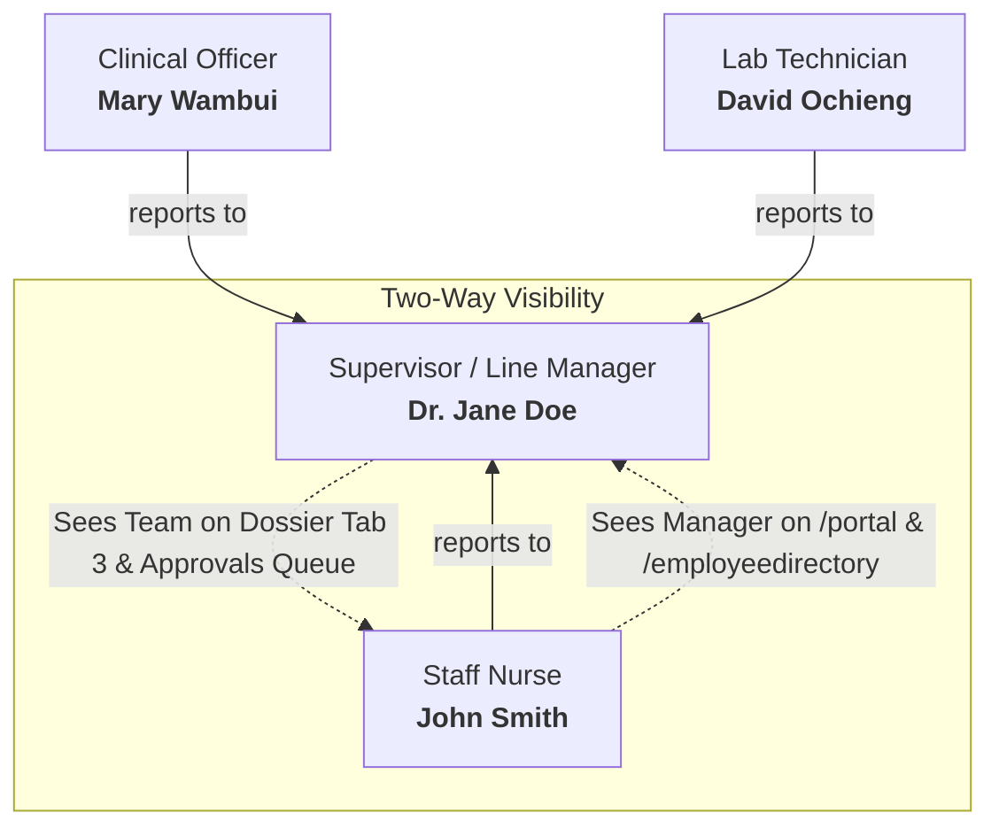
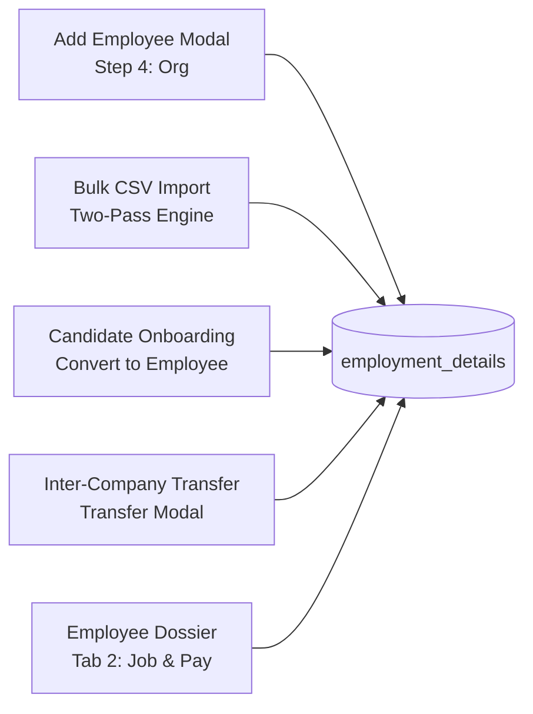
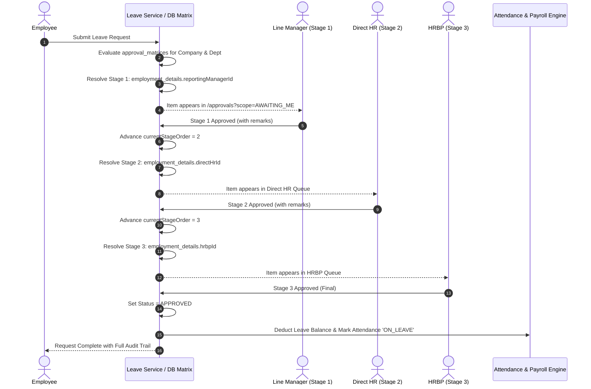
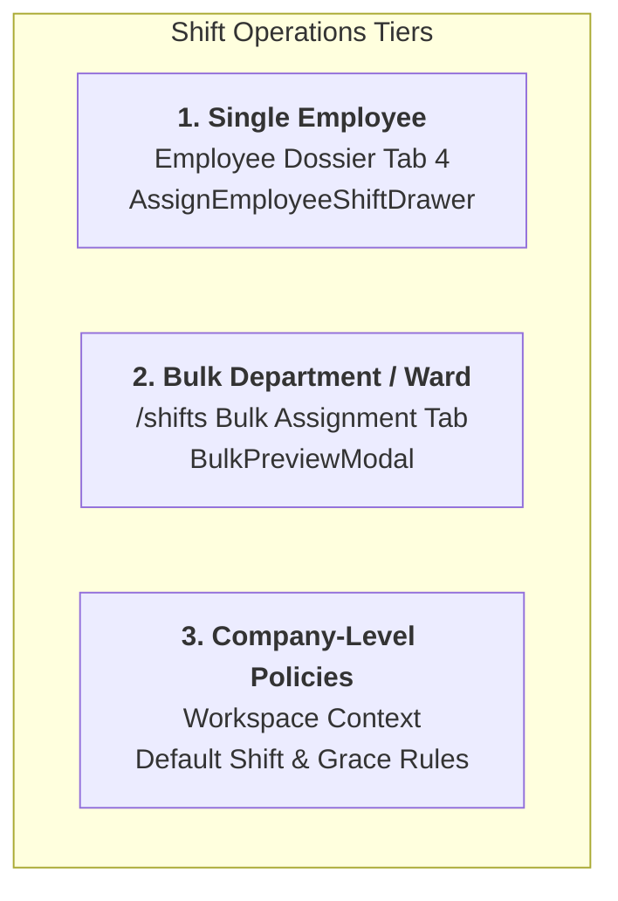

# Africare Enterprise HRMS — Assignments, Hierarchy, Approval Matrix & Shift Operations Manual

**Document Version:** 1.0  
**Target Platform:** Africare Enterprise HRMS (Hospital & Healthcare Multi-Tenant Suite)  
**Operating Companies:** Lifecare Hospitals, Africare Global, Bliss Healthcare, Nairobi Medical Centre (NMC), Star Discover  
**Architecture Mandate:** 100% Database-Driven, Zero Hardcoded Values, No Fallbacks  

---

## Chat Assistance & Architecture Decisions Summary

This document captures the implementation, architectural decisions, and operational instructions established during the chat assistance session regarding workforce assignments, approval workflows, and rostering:

| User Requirement / Mandate | Technical Resolution | Core Implementation Rules |
| :--- | :--- | :--- |
| **1. Line Manager Assignment & Two-Way Visibility** | Implemented 5 entrypoints for manager assignment (`employment_details.reportingManagerId`). Enabled two-way visibility: subordinate sees manager on `/portal` & `/employeedirectory`; manager sees team on Dossier Tab 3 & `/approvals?scope=AWAITING_ME`. | Self-reporting prevented at DB level. Two-pass CSV import resolves relationships without FK conflicts. |
| **2. Direct HR & HRBP Assignment & View** | Added separate `directHrId` (Day-to-day HR officer) and `hrbpId` (Senior HR Business Partner) to `employment_details` with foreign keys and indexes. | **100% Dynamic Lookup:** `GET /api/employees/hr-staff?companyId={id}` queries active HR staff directly from DB. Zero hardcoded names or mock IDs. |
| **3. Approval Matrix Setting & View** | Multi-stage dynamic approval matrix stored company-wise in `approval_matrices` (1-stage, 2-stage, or 3-stage). Dynamic approver resolution per stage. | **Strict Mandate:** ZERO hardcoded fallback values. Approvals queue strictly scoped (`scope=AWAITING_ME`). ESS visual stage progress tracker for employees. |
| **4. Shift Changes (Single, Bulk, Company-Level)** | Three operational tiers: (1) Single staff via Dossier Tab 4 `AssignEmployeeShiftDrawer`; (2) Bulk staff via `/shifts` Bulk Assignment tab with `BulkPreviewModal`; (3) Company-level via Default Shift/Schedule toggles and `/attendance` Shift & Grace Policies. | Live pre-commit impact preview. Single-transaction batch execution. Company-scoped defaults. |

---

## 1. Line Manager Assignment & Two-Way Hierarchy View

### 1.1 Architecture & Database Schema
In enterprise healthcare environments, clinical and operational staff report strictly to a designated supervisor. Self-reporting is blocked by database constraints.

- **Database Table:** `employment_details`
  - Column: `reportingManagerId NVARCHAR(36) NULL`
  - Foreign Key: `FK_employment_details_employees_reportingManagerId` referencing `employees(id)`
  - Index: `IX_employment_details_reportingManagerId`



### 1.2 The Five Entrypoints for Assigning a Line Manager



| Entrypoint | Location / Route | How It Works |
| :--- | :--- | :--- |
| **1. New Employee Creation** | `/employees` $\to$ **+ Add Employee** | **Step 4 (Organisation):** Dropdown queries `GET /api/employees/managers?companyId={id}` dynamically from active database employees. Self-assignment is blocked. |
| **2. Bulk Employee Import (CSV)** | `/employees` $\to$ **Bulk Upload** | Column `Reporting Manager Employee ID` (or `Direct_Manager_Id`). Processed in a **Two-Pass Database Algorithm**: Pass 1 inserts all employee records; Pass 2 links manager relationships across batch and database to prevent foreign key deadlocks. |
| **3. Candidate Onboarding** | `/recruitment` $\to$ **Pipeline** $\to$ **Hired** $\to$ **Convert to Employee** | The onboarding drawer queries active managers or auto-resolves the Department Head from `departments.headId`. |
| **4. Inter-Company Transfer** | `/employees` $\to$ **Dossier** $\to$ **Transfer Employee** | Selecting a destination operating company dynamically fetches managers scoped to that destination company. |
| **5. Employee Dossier Reassignment** | `/employees` $\to$ **Dossier** $\to$ **Tab 2: Job & Pay** | Dedicated **Reporting Line Manager** card provides an inline dropdown and **Update** button, persisting changes immediately to `employment_details`. |

### 1.3 Two-Way Visibility (Both Sides Can See)

#### A. Employee Perspective (Subordinate View)
1. **Self-Service Employee Portal (`/portal`)**:
   - The top gradient hierarchy card displays:
     - **DIRECT REPORTING LINE MANAGER** `[Stage 1 Approver]`
     - Supervisor Full Name, Department, and Designation.
     - Explanation: *"All time-off requests, overtime sign-offs, and roster adjustments route directly to your line manager."*
2. **Staff Directory (`/employeedirectory`)**:
   - Both the tabular register and grid cards display the manager's name (`emp.reportingManagerName`), enabling staff to confirm reporting structures.

#### B. Manager Perspective (Supervisor View)
1. **Dossier Direct Reports Tab (`/employees` $\to$ Dossier $\to$ Tab 3: Direct Reports)**:
   - Lists all subordinates reporting directly to the manager. Displays employee number, full name, clinical designation, contact details, and employment status.
2. **Pending Approvals Inbox (`/approvals?scope=AWAITING_ME`)**:
   - Subordinate leave applications, punch regularisations, and shift change requests route directly to the manager's personal action queue.

---

## 2. Direct HR & HRBP Assignment & Multi-Tier Governance

### 2.1 Enterprise Hospital Roles Defined
In complex hospital networks, human resource oversight is divided between operational administration and strategic compliance:
- **Direct Reporting Line Manager (`ReportingManagerId` / `ReportingManagerName`)**: The clinical supervisor, department head, or ward matron responsible for operational workforce coverage (Stage 1 Approver).
- **Direct HR Officer (`DirectHrId` / `DirectHrName`)**: The designated day-to-day HR officer handling employee records, statutory payroll documentation, leave balances, and attendance rectifications.
- **HR Business Partner (`HrbpId` / `HrbpName`)**: The senior HRBP overseeing departmental governance, statutory compliance, disciplinary audits, and multi-tier approval authorizations (Stage 2/3 Approver).

### 2.2 Database Schema
```sql
ALTER TABLE [employment_details] 
ADD [directHrId] NVARCHAR(36) NULL,
    [hrbpId] NVARCHAR(36) NULL;

ALTER TABLE [employment_details] 
ADD CONSTRAINT [FK_employment_details_employees_directHrId] 
FOREIGN KEY ([directHrId]) REFERENCES [employees]([id]);

ALTER TABLE [employment_details] 
ADD CONSTRAINT [FK_employment_details_employees_hrbpId] 
FOREIGN KEY ([hrbpId]) REFERENCES [employees]([id]);

CREATE INDEX [IX_employment_details_directHrId] ON [employment_details]([directHrId]);
CREATE INDEX [IX_employment_details_hrbpId] ON [employment_details]([hrbpId]);
```

### 2.3 Dynamic Lookup Endpoint
`GET /api/employees/hr-staff?companyId={id}`:
- Queries database table `employees` joined with `employment_details` and `departments`.
- Dynamically matches active staff whose department contains `"Human Resources"` / `"HR"` or whose job title contains `"HR"`, `"Manager - HR"`, or `"HRBP"`.
- **Zero hardcoding**: Results are 100% database-driven (returned 55 active HR staff in verification).

### 2.4 Where Direct HR and HRBP Are Assigned
1. **New Hire Modal (`CreateEmployeeModal`)**: Step 4 includes separate selectors for **Assigned Direct HR** and **Assigned HRBP**.
2. **Employee Dossier Drawer (`EmployeeDossierDrawer` $\to$ Tab 2: Job & Pay)**:
   - Dedicated card: **Direct HR Officer & HRBP Assignments**.
   - Displays current assignments with individual reselection dropdowns and an **Update HR Nodes** action button.
3. **Inter-Company Transfer Modal (`EmployeeTransferModal`)**:
   - Contains fields for **New Direct HR Officer (Destination)** and **New HRBP (Destination)**.
4. **Candidate Onboarding Drawer (`CandidateOnboardingDrawer`)**:
   - Maps both `HrbpId` and `DirectHrId` during recruitment candidate conversion.
5. **Bulk CSV Import**:
   - Columns `Direct HR Employee ID` and `HRBP Employee ID` resolved via dynamic two-pass linking.

### 2.5 Where Direct HR and HRBP Are Viewed
- **ESS Portal Dashboard (`/portal`)**:
  - The hierarchy banner renders dedicated sub-nodes:
    - **ASSIGNED DIRECT HR** `[Day-to-Day HR]`: Assigned HR Officer name.
    - **ASSIGNED HRBP** `[Stage 2 Approver]`: Designated HRBP name.
- **Employee Directory (`/employeedirectory`)**:
  - Table column and grid cards render `HR: {Direct HR Name or HRBP Name}`.
- **Employee Dossier (`/employees` $\to$ Tab 2)**:
  - Full details visible with audit logs and reassignment controls.

---

## 3. 100% Database-Driven Company Approval Matrix

### 3.1 Strict Mandate: Zero Hardcoded Logic
- **No Mock Approvers**: System never falls back to artificial IDs (e.g. `seed-emp-00003`, `seed-emp-00647`, `usr-002`, `Caroline Nduta`).
- **100% Dynamic Rules**: Every sequence is loaded from `approval_matrices` where `matrixType = 'LEAVE'`.
- **Company-Specific Configurations**: Companies can run 1-stage (Direct Supervisor), 2-stage (Line Manager $\to$ Direct HR), or 3-stage (Line Manager $\to$ Direct HR $\to$ HRBP / Medical Director) workflows.

### 3.2 Matrix Data Structure
In database table `approval_matrices`:
```json
[
  {
    "step": 1,
    "role": "LINE_MANAGER",
    "stepName": "Stage 1: Line Manager Review",
    "slaHours": 48
  },
  {
    "step": 2,
    "role": "DIRECT_HR",
    "stepName": "Stage 2: Direct HR Officer Verification",
    "slaHours": 24
  },
  {
    "step": 3,
    "role": "HRBP",
    "stepName": "Stage 3: HRBP Final Sign-Off",
    "slaHours": 24
  }
]
```

### 3.3 Dynamic Multi-Stage Progression Workflow



1. **Leave Application (`ApplyLeaveAsync`)**:
   - The engine evaluates `approval_matrices` for the employee's company, department, and grade.
   - Resolves Stage 1 Approver from `employment_details.reportingManagerId`.
   - Populates on `leave_requests`:
     - `currentStageOrder = 1`
     - `totalStages = steps.Count`
     - `currentStageName = "Stage 1: Line Manager Review"`
     - `currentApproverEmployeeId = manager.Id`
     - `currentApproverUserId = manager.UserId`
     - `currentApproverRole = "LINE_MANAGER"`
     - `approverSequenceJson = stepsJson`
     - `status = "PENDING_MANAGER"`
2. **Intermediate Stage Approval (`ApproveLeaveAsync`)**:
   - If `currentStageOrder < totalStages`:
     - Advances `currentStageOrder += 1`.
     - Resolves next approver from database:
       - If next role is `DIRECT_HR`: resolves from `employment_details.directHrId`.
       - If next role is `HRBP`: resolves from `employment_details.hrbpId`.
       - If next role is `DEPT_HEAD`: resolves from `departments.headId`.
     - Updates `currentApproverEmployeeId`, `currentApproverUserId`, `currentStageName`.
     - Status updates to `PENDING_HR`.
     - Appends decision entry to `leave_decisions` table with timestamp and remarks.
3. **Final Stage Approval**:
   - When `currentStageOrder >= totalStages`:
     - Status updates to `APPROVED`.
     - Leave balance moves: `Pending` balance decremented, `Taken` balance incremented.
     - Synchronizes daily biometric attendance table (`attendance_records` marked as `ON_LEAVE` with leave description notes).

### 3.4 Strict Assignee Queue Scoping (`/approvals?scope=AWAITING_ME`)
Items appear in `/approvals?scope=AWAITING_ME` **only** if:
$$\text{item.ApproverEmployeeId} == \text{currentEmployeeId} \quad \lor \quad \text{item.ApproverUserId} == \text{currentUserId}$$
*(Superadmins retain emergency multi-facility override privileges).*

Staff members who are not the designated approver for the active stage cannot see or approve the request.

### 3.5 Employee Self-Service (ESS) Stage Tracking
On `/portal` and `/leave`:
- Employees view a visual **Multi-Stage Progress Tracker**:
  - **Completed Stages**: Green checkmark, approver full name, decision timestamp, and official remarks.
  - **Active Stage**: Amber glowing badge, current assigned approver, and SLA turnaround timer.
  - **Upcoming Stages**: Neutral outlined card showing role and pending requirements.

---

## 4. Shift Changes & Rostering Operations

Hospital shifts operate across three functional scopes:



### 4.1 Single Employee Shift Change (Individual Assignment)

#### Workflow via Employee Dossier (`/employees`):
1. Navigate to **Employee Management** $\to$ **[Employee List](http://localhost:4000/employees)**.
2. Click on the employee to open the **8-Tab Employee Dossier Drawer**.
3. Select **Tab 4: "Shifts & Rostering"** (`EmployeeShiftTab.tsx`).
4. Inspect the employee's active shift pattern (e.g. *General Day Shift 08:00–17:00*, *Night Duty 19:00–07:00*), weekly contracted hours, and past roster changes.
5. Click **"+ Assign Shift"** or **"Temporary Override"**:
   - The right slide-over **`AssignEmployeeShiftDrawer`** opens.
   - Select **New Working Shift**.
   - Choose **Assignment Type**:
     - *Specific Shift Pattern* (Permanent schedule change)
     - *Temporary Override* (Single-date or short-term coverage)
     - *Rotation Period* (Multi-week clinical rotation)
     - *Work Schedule Baseline* (Full weekly template)
   - Define **Effective From** date (and optional **Effective To** date).
   - Set applicable days of the week (Sun–Sat) and enter audit justification.
6. Click **Confirm Assignment** $\to$ Persisted to `employee_shift_assignments` and synced with daily attendance registers.

---

### 4.2 Multiple Employees Shift Change (Bulk Roster Assignment)

When rotating duty rosters across an entire clinical department, ward, or hospital branch:

#### Workflow via Shifts Hub (`/shifts`):
1. Navigate to **System Configuration** $\to$ **[Shifts & Schedules](http://localhost:4000/shifts)**.
2. Click the **"Bulk Assignment"** tab (`BulkAssignmentTab.tsx`).
3. Set the target audience filter:
   - **Department Scope**: Target specific departments (e.g. *Anaesthesiology*, *Accident & Emergency*, *Housekeeping*, *Nephrology*), or leave blank for all departments.
   - **Location Scope**: Target a hospital facility (e.g. *Nairobi Main*, *Bungoma Hospital*, *Eldoret Branch*), or leave blank for all locations.
4. Select the destination parameters:
   - **New Working Shift**: e.g. *Night Shift (19:00–07:00)*.
   - **New Work Schedule Baseline**: e.g. *Standard Hospital 40h* or *Clinical 48h 6-Day*.
   - **Effective Date**: Choose the transition date.
   - **Reason**: Enter administrative justification (e.g. *"Q4 Monthly Ward Shift Rotation"*).
5. Click **"Preview Bulk Assignment"**:
   - Opens the **Bulk Preview Modal** (`BulkPreviewModal.tsx`), displaying:
     - Total headcount affected.
     - Table of matching employees with their current shift vs. new assigned shift.
6. Click **"Commit Bulk Shift Assignment"**:
   - Executes `POST /api/shifts/bulk/commit`, updating all target employee records in a single database transaction.

---

### 4.3 Company-Level Shift & Policy Configuration

In a multi-facility enterprise (Lifecare Hospitals, Africare Global, Bliss Healthcare):

1. **Workspace Company Context**:
   - Select the target operating company using the header workspace switcher (e.g. `LIFECARE - Lifecare Hospitals`).
2. **Company Default Shift**:
   - Under `/shifts` $\to$ **"Shift Policies"** tab, edit or create a shift and toggle **`Is Default Shift for Company`**.
   - Any employee created without an explicit shift automatically inherits this company default.
3. **Company Default Work Schedule**:
   - Under `/shifts` $\to$ **"Work Schedules"** tab, click **"Set as Default"** on the desired template.
4. **Attendance Punctuality & Grace Policies**:
   - In **Attendance** $\to$ **"Shift & Grace Policies"** (`/attendance` Tab 6):
     - Configure **Grace Late Tolerance** (e.g. 15 minutes before late penalties trigger).
     - Configure **Flexi-Window Minutes** (grace arrival window).
     - Configure **Half-Day Threshold** (minimum duty hours required for full day wage).
     - Configure **Overtime Threshold** (minutes past shift end before OT starts accumulating).
     - Configure **Statutory Payroll Deduction Mechanism** for unregularised infractions.

---

## 5. Verification & Testing Reference

| Scope | Automated Test / Verification Script | Result / Status |
| :--- | :--- | :--- |
| **Hierarchy & Foreign Keys** | `LineManagerHierarchyTests.cs` | 37 tests passed (`dotnet test backend/Tests/Tests.csproj`) |
| **HR Staff Resolution** | Local Python audit script querying API | `GET /api/employees/hr-staff` $\to$ Returns 55 active HR records from database |
| **Direct HR & HRBP Persistence** | Integration test verifying `PUT /api/employees/{id}` | Verified `directHrId` & `hrbpId` persisted and returned in dossier & list |
| **Frontend Compilation** | TypeScript compiler | `cd frontend && npx tsc --noEmit` (0 errors) |
| **Browser Visual Verification** | Headless Chrome session | Verified `/portal`, `/employeedirectory`, and Dossier Drawer |

---
*Africare Health Network • Enterprise HRMS Technical Documentation*
