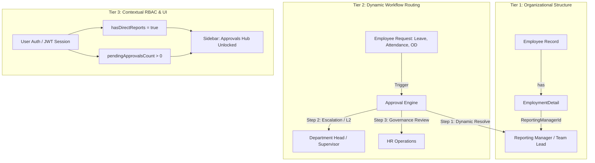

# Enterprise HRMS Approval Architecture & Dynamic Reporting Hierarchy

## 1. Executive Summary & Problem Statement

### 1.1 The Core Challenge
In real-world organizations, **Job Title / Designation does not equal Reporting Authority**:
* A Senior Software Engineer, Lead Nurse, or Principal Specialist may not have "Manager" in their official job designation, but they lead 4 to 8 team members whose Leave, On-Duty (OD), Attendance Regularisation, and Expense requests they must review and approve.
* A "General Manager" or "Director" may be an individual contributor reporting to executive leadership with zero direct reports.
* Conflating designation (`Designation.Name == "Manager"`) or static RBAC roles (`Role == "LINE_MANAGER"`) with approval rights leads to brittle systems, excessive administrative overhead, and security loopholes.

### 1.2 The Guiding Principles
1. **All System Users are Employees**: Every user record links directly to an active `Employee` record.
2. **Reporting Relationship is a Graph**: Any active employee can be mapped as the `ReportingManagerId` of another employee, regardless of designation, grade, or department.
3. **Dynamic Contextual Authority**: If an employee has one or more active team members mapped to them, they automatically gain manager-level review authority over their direct team without requiring manual role reassignment by HR.
4. **Strict Inbox Scoping**: Approvers only see requests from employees mapped to them (unless elevated to HR/Global audit scopes).
5. **Self-Approval Prevention & Auto-Escalation**: When an approver submits their own request, the workflow automatically routes it to *their* manager (L2 / Department Head).

---

## 2. The 3-Tier Architecture



### Tier 1: Organizational Hierarchy (The Source of Truth)
* Located in `EmploymentDetail.ReportingManagerId`.
* Foreign key pointing to `Employee.Id`.
* Establishes the primary supervisory tree.

### Tier 2: Dynamic Routing Engine (`ApprovalEngine`)
* When an item is submitted, the engine queries the submitter's `ReportingManagerId`.
* Evaluates self-approval: If `submitter.Id == reportingManager.Id`, the engine automatically escalates to the submitter's manager (`higherMgr`).
* Resolves step-by-step approval tiers (`L1_MANAGER` $\rightarrow$ `DEPT_HEAD` $\rightarrow$ `HR_REVIEW`).

### Tier 3: Contextual Permissions & Access Control
* **Base Role**: Employee (can submit requests, view self-service).
* **Contextual Role**: Manager (dynamically enabled if `DirectReports.Count > 0` or assigned pending tasks).
* **Elevated Role**: HR Manager / Admin (company-wide or department-wide visibility).

---

## 3. Data Model & Database Design

### 3.1 Employee & Employment Detail
```csharp
public class EmploymentDetail
{
    public string Id { get; set; }
    public string EmployeeId { get; set; }
    
    // Direct Reporting Hierarchy
    public string? ReportingManagerId { get; set; }
    public virtual Employee? ReportingManager { get; set; }
    
    // Optional Secondary / Functional Reporting (e.g., Matrix Lead, Clinical Supervisor)
    public string? FunctionalManagerId { get; set; }
    public virtual Employee? FunctionalManager { get; set; }

    public string? DepartmentId { get; set; }
    public virtual Department? Department { get; set; }
    public EmployeeStatus Status { get; set; } = EmployeeStatus.ACTIVE;
}
```

### 3.2 Standardized Pending Approval Item Schema
Every module (Leave, Attendance Regularisation, Overtime, Requisition, Loan) surfaces pending items through a unified approval contract:

```csharp
public class PendingApprovalDto
{
    public string Id { get; set; }
    public string EntityType { get; set; } // "LEAVE", "ATTENDANCE_REG", "OD", "REQUISITION"
    public string ReferenceNumber { get; set; }
    
    // Submitter Details
    public string SubmitterEmployeeId { get; set; }
    public string SubmitterName { get; set; }
    public string? DepartmentName { get; set; }

    // Assigned Approver Details
    public string AssignedApproverEmployeeId { get; set; }
    public string AssignedApproverRole { get; set; } // "REPORTING_MANAGER", "DEPT_HEAD", "HR_REVIEW"
    public string CurrentStage { get; set; }

    // Audit & SLA
    public DateTime SubmittedAt { get; set; }
    public DateTime SlaDueDate { get; set; }
    public bool IsOverdue { get; set; }
    public bool IsSelfApprovalEscalated { get; set; }
    public string? EscalationReason { get; set; }
}
```

---

## 4. Backend Context & Scoping Logic

### 4.1 Approver Context Resolution
In `ApprovalsService`:
```csharp
public async Task<ApproverContext> ResolveApproverContextAsync(string targetCompany, CancellationToken ct)
{
    var userId = _currentUserService.UserId;
    var isSuperAdmin = _currentUserService.IsSuperAdmin;
    var roleCode = _currentUserService.RoleCode?.ToUpperInvariant() ?? "";

    // 1. Resolve current user's employee record
    var currentEmp = await _context.Employees
        .Include(e => e.EmploymentDetail)
        .FirstOrDefaultAsync(e => e.CompanyId == targetCompany && e.UserId == userId, ct);

    if (currentEmp == null)
    {
        return new ApproverContext { IsAdminOrHr = isSuperAdmin };
    }

    // 2. Dynamic check: does this employee have direct reports?
    var directReportsCount = await _context.EmploymentDetails
        .CountAsync(ed => ed.ReportingManagerId == currentEmp.Id && ed.Status == EmployeeStatus.ACTIVE, ct);

    // 3. Dynamic check: are there tasks explicitly assigned to this employee?
    var pendingAssignedCount = await _context.ApprovalTasks
        .CountAsync(t => t.AssignedApproverEmployeeId == currentEmp.Id && t.Status == "PENDING", ct);

    var isHrOrAdmin = isSuperAdmin || roleCode == "HR_MANAGER" || roleCode == "SUPER_ADMIN";

    return new ApproverContext
    {
        CurrentEmployeeId = currentEmp.Id,
        HasDirectReports = directReportsCount > 0,
        DirectReportsCount = directReportsCount,
        PendingAssignedCount = pendingAssignedCount,
        IsAdminOrHr = isHrOrAdmin
    };
}
```

### 4.2 Query Scoping ("Awaiting My Action" Inbox)
When the approver visits `/approvals`:
```csharp
// Scope items to the logged-in employee:
if (!context.IsAdminOrHr)
{
    // A standard employee with direct reports only sees requests where:
    // 1. The item is explicitly assigned to them as Approver
    // 2. OR the submitter's direct ReportingManager is them
    query = query.Where(item =>
        item.AssignedApproverEmployeeId == context.CurrentEmployeeId ||
        item.SubmitterReportingManagerId == context.CurrentEmployeeId
    );
}
// HR / Admin can see global or department queues
```

---

## 5. Frontend Dynamic UI & Navigation

### 5.1 Sidebar Menu Dynamic Availability
In `Sidebar.tsx`:
```typescript
const canViewApprovals = 
    hasPermission("approvals.view") || 
    currentUser.hasDirectReports || 
    currentUser.pendingApprovalsCount > 0;

// Render Approvals link if canViewApprovals is true
```

### 5.2 Approvals View Layout
Provide clear, segmented tab navigation:
1. **Awaiting My Action (Badge: Pending Count)**: Direct reports' items requiring immediate action.
2. **My Team's Requests**: Overview of all direct reports' requests (Pending, Approved, Rejected).
3. **Organization Queue (Conditional)**: Only visible to HR Managers / System Administrators.

---

## 6. Edge Cases & Enterprise Guardrails

| Edge Case | Failure Scenario | Enterprise Solution |
| :--- | :--- | :--- |
| **Self-Approval** | Team Lead applies for leave; system routes it back to themselves. | `ApprovalEngine` detects `SubmitterId == ReportingManagerId` and auto-escalates to L2 supervisor. |
| **Manager on Leave (OOF)** | Senior employee is on 14-day annual leave; direct reports' requests get stuck. | Approver sets a temporary **Delegate**; engine auto-delegates during the active OOF window or escalates after 48h SLA breach. |
| **Manager Exit / Transfer** | Manager resigns or is transferred; direct reports become "orphans". | Offboarding workflow warns HR of direct reports needing reassignment; unassigned reports auto-escalate to Department Head. |
| **Circular Reporting** | Emp A reports to Emp B, Emp B reports to Emp A. | Database validation / service-layer check prevents cycles when updating `ReportingManagerId`. |

---

## 7. Step-by-Step Implementation & Closure Roadmap

Follow these 5 distinct phases to start, implement, test, and formally close this feature:

### Phase 1: Organizational Hierarchy & DB Verification
- [ ] **Step 1.1**: Verify `EmploymentDetails.ReportingManagerId` has an indexed foreign key to `Employees.Id`.
- [ ] **Step 1.2**: Ensure Employee Edit/Create forms allow selecting any active employee as `ReportingManager`, without restricting to employees with "Manager" job title.
- [ ] **Step 1.3**: Add circular reporting check in employee service to prevent infinite loops (e.g., A reports to B and B reports to A).

### Phase 2: Backend Context & Resolution Engine
- [ ] **Step 2.1**: Update `ICurrentUserService` or `ApprovalsService` to resolve `CurrentEmployeeId`, `HasDirectReports`, and `DirectReportsCount`.
- [ ] **Step 2.2**: Update `/api/auth/me` or `/api/approvals/context` to return `hasDirectReports` and `pendingApprovalsCount` to the frontend client.
- [ ] **Step 2.3**: Update `ApprovalEngine.ResolveApproverForStepAsync` to dynamically resolve the submitter's direct `ReportingManagerId` for `REPORTING_MANAGER` role steps.
- [ ] **Step 2.4**: Verify self-approval escalation routes to the L2 manager or Department Head.

### Phase 3: Approval Query Scoping & Action Protection
- [ ] **Step 3.1**: In `ApprovalsService.GetPendingApprovalsAsync`, replace naive string role checks (`roleId.Contains("mgr")`) with strict employee ID and direct report filtering.
- [ ] **Step 3.2**: In `ApprovalsController.DecideApproval`, enforce authorization: ensure the acting user is either the assigned approver, the direct manager, or has `approvals.admin` override permission.

### Phase 4: Frontend UI Dynamic Menus & Approval Hub
- [ ] **Step 4.1**: Update `Sidebar.tsx` to display the "Approvals" menu item if `user.hasDirectReports` is true or `pendingApprovalsCount > 0`.
- [ ] **Step 4.2**: In `/approvals`, display the "Awaiting My Action" tab showing only direct reports' submissions with clear employee avatars, dates, and action buttons.
- [ ] **Step 4.3**: Add "My Team" filter to give the team lead visibility into their members' attendance and leave history.

### Phase 5: Verification, Testing & Final Closure
- [ ] **Step 5.1 (Test Case 1 - Team Lead Approver)**:
  - Create Senior Employee (e.g., "Jane Lead", title "Senior Developer").
  - Map 2 staff members to Jane as their `ReportingManager`.
  - Log in as Jane: Verify "Approvals" appears in sidebar.
- [ ] **Step 5.2 (Test Case 2 - Scoped Inbox)**:
  - Staff member submits Leave & Attendance Regularisation.
  - Jane's Approvals Hub shows exactly those 2 requests.
  - Another unrelated employee submits Leave: Jane does NOT see it.
- [ ] **Step 5.3 (Test Case 3 - Self Approval Escalation)**:
  - Jane submits her own Leave request.
  - Verify Jane cannot approve her own request; it is routed to Jane's manager (Department Head).
- [ ] **Step 5.4 (Test Case 4 - Manager Reassignment)**:
  - Reassign the 2 staff members away from Jane (Jane now has 0 direct reports).
  - Log in as Jane: Verify "Approvals" menu item is cleanly hidden.
- [ ] **Step 5.5**: Sign-off and merge documentation.
