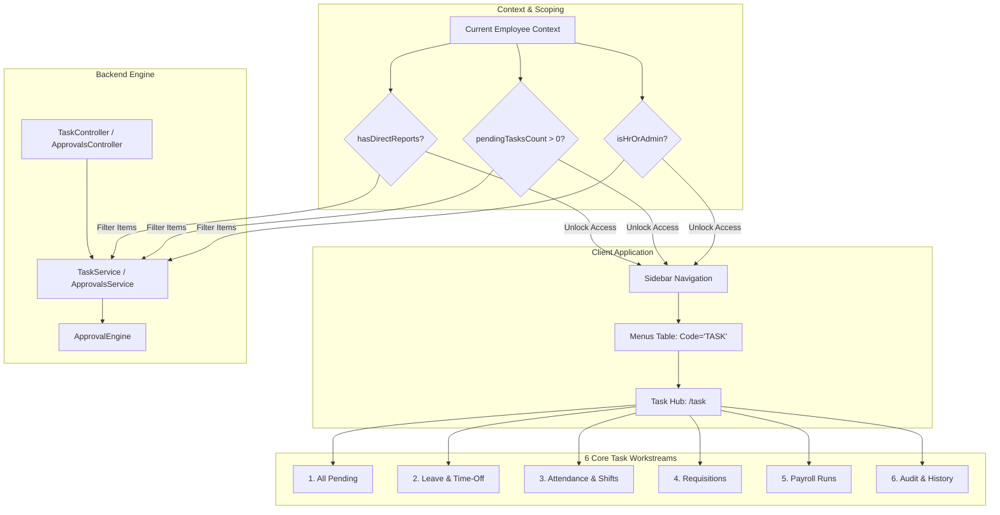
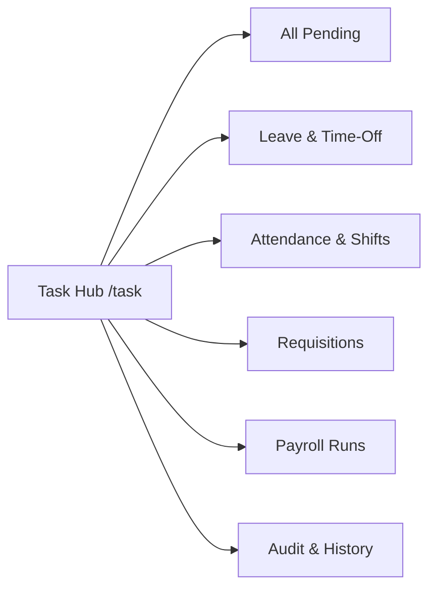

# Enterprise HRMS Approval Architecture, Dynamic Reporting Hierarchy & Unified Task Hub

## 1. Executive Summary & Problem Statement

FOLLOW THE INSTRUCTION OF docs/follow.md file.

### 1.1 The Core Challenge

In real-world enterprises, **Job Title / Designation does not equal Reporting Authority**:

- A **Senior Software Engineer**, **Lead Nurse**, or **Principal Specialist** may not have "Manager" in their official job designation, but they lead 4 to 8 team members whose Leave, On-Duty (OD), Attendance Regularisation, and Expense requests they must review and approve.
- A "General Manager" or "Director" may be an individual contributor reporting to executive leadership with zero direct reports.
- Conflating designation (`Designation.Name.Contains("Manager")`) or static RBAC roles (`Role == "LINE_MANAGER"`) with approval rights leads to brittle systems, excessive administrative overhead, and security loopholes.

### 1.2 The Guiding Principles

1. **All System Users are Employees**: Every user record in the system links directly to an active `Employee` record.
2. **Reporting Relationship is a Directed Acyclic Graph**: Any active employee can be mapped as the `ReportingManagerId` of another employee, regardless of designation, grade, or department.
3. **Dynamic Contextual Authority**: If an employee has one or more active team members mapped to them, they automatically gain manager-level review authority over their direct team without requiring manual role reassignment by HR.
4. **Strict Inbox Scoping**: Approvers only see requests from employees mapped to them (unless elevated to HR/Global audit scopes).
5. **Self-Approval Prevention & Auto-Escalation**: When an approver submits their own request, the workflow automatically routes it to _their_ manager (L2 / Department Head).
6. **Unified Task Hub (`/task`)**: All pending approvals, reviews, and sign-offs across Leave, Attendance, Requisitions, and Payroll are consolidated into a single, high-efficiency Task Page.

---

## 2. The Unified Task Hub Architecture (`/task`)



### 2.1 Endpoint & Routing Specification

- **Frontend Route**: `/task` (or `/approvals` alias)
- **Backend API Controller**: `TaskController` (aliased with `ApprovalsController`)
- **Service Contract**: `ITaskService` / `IApprovalsService`
- **Module Identifier**: `Task` / `Approvals`

### 2.2 Database Menu Table Entry

The Task Hub is registered in the database `Menus` table to ensure dynamic, database-driven navigation:

```sql
INSERT INTO "Menus" (
    "Id", "Name", "Code", "Icon", "ParentId", "Route",
    "PermissionModule", "PermissionCode", "Type", "SortOrder",
    "IsActive", "IsVisible", "CreatedAt"
) VALUES (
    'menu-task-hub', 'Task', 'TASK', 'CheckSquare', NULL, '/task',
    'Task', NULL, 'Parent', 2,
    TRUE, TRUE, NOW()
);
```

#### Dynamic Navigation Unlocking Logic

In `MenuService` and `Sidebar.tsx`, the `Task` menu item is unlocked automatically if **ANY** of the following conditions are met:

1. `user.hasDirectReports == true` (Employee has 1 or more active direct team members).
2. `user.pendingTasksCount > 0` (Employee has tasks explicitly assigned to them).
3. `user.hasPermission("task.view") || user.hasPermission("approvals.view") || user.isHrOrAdmin`.

---

## 3. The 6 Core Task Workstreams (Tabs & Modules)

The Task Hub provides a unified, tabbed operational workbench organized into 6 distinct workstreams:



### 1. All Pending

- **Purpose**: Aggregate inbox consolidating every item awaiting the user's action across all domains.
- **Sorting**: Strict SLA urgency (`IsOverdue` first, then earliest `SlaDueDate`).
- **KPI Metrics**: Total Pending, Overdue Items, Compliance Rate %, Processed This Month.
- **Bulk Bar**: Multi-select items for one-click batch approval.

### 2. Leave & Time-Off

- **Entities**: Annual Leave, Sick Leave, Maternity/Paternity, Compassionate Leave, Compensatory Off.
- **Key Context Surfaced**:
  - Requested date range and total days.
  - Submitter leave balance summary (Available vs Requested).
  - Relief / handover colleague name.
  - Overlap warning (other team members away on same dates).
- **Decisions**: `APPROVE` (advances to Tier 2 HR or finalizes), `REJECT` (refunds pending balance), `RETURN` (requests clarification).

### 3. Attendance & Shifts

- **Entities**: Punch Regularisations / Corrections, Out-of-Duty (OD) / Field Visit requests, Shift Swap requests, Overtime (OT) pre-approvals.
- **Key Context Surfaced**:
  - Shift date and scheduled hours vs requested in/out punches.
  - Reason for irregularity (Device Offline, Field Visit, Transport Delay, Client Emergency).
  - Biometric log verification status.
- **Decisions**: `APPROVE` (updates attendance record directly), `REJECT` (maintains original status).

### 4. Requisitions & Offers

- **Entities**: Headcount Job Requisitions, Replacement Requests, Candidate Employment Offers.
- **Key Context Surfaced**:
  - Position title, department, headcount count, budget range.
  - Justification, replacement details, and business case.
  - Proposed candidate compensation vs approved grade band.
- **Decisions**: `APPROVE` (advances through multi-step matrix), `REJECT`, `RETURN` (for budget rework).

### 5. Payroll Runs

- **Entities**: Monthly Payroll Computations, Off-Cycle Bonus runs, Statutory deduction batches (SHIF, NSSF, Housing Levy, PAYE).
- **Key Context Surfaced**:
  - Month key, total headcount, Gross Payroll, Net Payout, Total Taxes.
  - Variance from previous month (+/- delta highlight).
- **Audience**: Finance Controllers, HR Directors, Managing Directors.

### 6. Audit & History

- **Purpose**: Immutable, chronological audit log of all decisions executed by the logged-in user or within their supervisory scope.
- **Key Fields**: Reference Number, Submitter, Action (`APPROVED`, `REJECTED`, `RETURNED`), Decided At timestamp, Remarks, Stage/Tier.
- **Export**: Filterable and exportable for statutory and internal audit compliance.

---

## 4. How Can We Improve the Process? (Enterprise Innovation)

To elevate the HRMS approval workflow from basic record manipulation to a world-class enterprise experience, we incorporate 8 key process improvements:

| Innovation                             | The Operational Problem                                                                                    | Enterprise Solution in Task Hub                                                                                                                                                                                                                         |
| :------------------------------------- | :--------------------------------------------------------------------------------------------------------- | :------------------------------------------------------------------------------------------------------------------------------------------------------------------------------------------------------------------------------------------------------ |
| **1. Unified Task Envelope**           | Every module (Leave, Attendance, Requisition) has a different data shape, requiring different UI handling. | **Normalized Task Envelope (`PendingApprovalDto`)**: Every request exposes a standardized schema (`EntityType`, `ReferenceNumber`, `SubmitterName`, `CurrentStage`, `SlaDueDate`, `DetailsPayloadJson`).                                                |
| **2. Team Calendar Overlap Drawer**    | Managers approve leave blindly, discovering later that 3 nurses from the same shift are away.              | **Staffing Presence Drawer**: Clicking any leave/OD card opens a slide-over showing who else on that team is on duty, on leave, or off on those specific dates.                                                                                         |
| **3. Visual SLA & Escalation Clock**   | Requests sit indefinitely in inboxes; employees cannot plan time off.                                      | **Visual Countdown Badges**: Green (>24h), Amber (<24h), Red (Overdue). Engine auto-escalates to L2 supervisor upon SLA breach.                                                                                                                         |
| **4. Bulk Sign-Off with Verification** | Managers spend 30 minutes clicking "Approve" on 15 individual punch corrections.                           | **Batch Action Bar**: Approver selects multiple verified items and clicks "Approve Selected" with a single batch audit comment.                                                                                                                         |
| **5. Self-Approval Trap Prevention**   | Team leads approve their own leave or overtime.                                                            | **Auto-Escalation Gate**: Submitter ID is matched against Assigned Approver ID. If identical, the engine bypasses the submitter and routes directly to their supervisor (L2 / Dept Head). Self-submissions are filtered out of the user's action inbox. |
| **6. Temporary Delegation (OOF Mode)** | Approver goes on 2-week leave; direct reports' workflows halt.                                             | **Out-of-Office Delegate**: Approver sets a peer delegate for a date window; engine automatically re-routes incoming direct report tasks to the delegate.                                                                                               |
| **7. Multi-Tier Visual Progress**      | Submitter doesn't know who has the request currently.                                                      | **Visual Stepper**: Clear tier breakdown (e.g. `Tier 1: Reporting Manager (Approved)` $\rightarrow$ `Tier 2: HR Operations (Pending)`).                                                                                                                 |
| **8. Scope Segmentation**              | Managers get overwhelmed by company-wide queues.                                                           | **Three Clear Inboxes**: `Awaiting My Action` (strictly assigned items), `My Team Requests` (full history of direct reports), and `Organization Queue` (HR/Admin only).                                                                                 |

---

## 5. Backend Implementation: Step 1 & Step 2 Details

### 5.1 Step 1: Organizational Hierarchy & DB Integrity

- **Foreign Key**: `EmploymentDetails.ReportingManagerId` links directly to `Employees.Id`.
- **Universal Eligibility**: Any active employee can be designated as a reporting manager in `EmployeeService.GetManagersAsync` regardless of whether their job title contains "Manager".
- **Cycle & Self-Reporting Prevention**: `EmployeeService` enforces loop detection:
  ```csharp
  // Prevents A -> B -> A circular dependencies:
  while (!string.IsNullOrEmpty(curMgrId) && depth < 20)
  {
      if (curMgrId == emp.Id)
      {
          throw new InvalidOperationException("Circular reporting hierarchy detected. An employee cannot report to their subordinate.");
      }
      curMgrId = await _context.EmploymentDetails
          .Where(ed => ed.EmployeeId == curMgrId)
          .Select(ed => ed.ReportingManagerId)
          .FirstOrDefaultAsync(ct);
      depth++;
  }
  ```

### 5.2 Step 2: Dynamic Approver Context & Scoping Logic

Implemented in `ApprovalsService.cs`:

```csharp
private async Task<(string? CurrentEmpId, bool IsHrOrAdmin, bool IsLineManager, int DirectReportsCount, string RoleCode)>
    ResolveApproverContextAsync(string targetCompany, CancellationToken ct)
{
    var userId = _currentUserService.UserId;
    var isSuperAdmin = _currentUserService.IsSuperAdmin || _currentUserService.IsDeveloper;
    var roleId = _currentUserService.RoleId;
    var role = await _context.Roles.FirstOrDefaultAsync(r => r.Id == roleId, ct);
    var roleCode = role?.Code?.ToUpperInvariant() ?? "";
    var roleLevel = (_currentUserService.RoleLevel ?? role?.RoleLevel ?? role?.Scope ?? "SELF").ToUpperInvariant();

    var isHrOrAdmin = isSuperAdmin ||
                      roleLevel == "GLOBAL" ||
                      roleLevel == "COMPANY" ||
                      roleCode == "HR_MANAGER" ||
                      roleCode == "ADMIN" ||
                      roleCode == "SUPER_ADMIN";

    // 1. Resolve employee record for logged-in user
    string? currentEmpId = await _context.Employees
        .Where(e => e.CompanyId == targetCompany && (e.UserId == userId || e.Id == userId))
        .Select(e => e.Id)
        .FirstOrDefaultAsync(ct);

    // 2. Dynamic direct reports count
    var directReportsCount = 0;
    if (!string.IsNullOrEmpty(currentEmpId))
    {
        directReportsCount = await _context.EmploymentDetails
            .CountAsync(ed => ed.ReportingManagerId == currentEmpId && ed.Status == EmployeeStatus.ACTIVE, ct);
    }

    // 3. Dynamic manager authority
    var isLineManager = !isHrOrAdmin && currentEmpId != null && (
        directReportsCount > 0 ||
        roleCode == "LINE_MANAGER" ||
        roleCode == "EMS" ||
        roleLevel == "DEPARTMENT"
    );

    return (currentEmpId, isHrOrAdmin, isLineManager, directReportsCount, roleCode);
}
```

### 5.3 Step 2 Scoping Engine ("Awaiting My Action")

Non-admin approvers only receive items where:

1. `i.EmployeeId != currentEmpId` and `i.SubmittedById != userId` (Self-Approval Prevention).
2. `(i.ApproverRole == "REPORTING_MANAGER" || i.ApproverRole == "LINE_MANAGER") && i.ReportingManagerId == currentEmpId` (Direct Reports).
3. `i.AssignedApproverEmployeeId == currentEmpId` or `i.AssignedApproverUserId == userId` (Explicit Assignment).

---

## 6. Implementation & Closure Roadmap

| Phase       | Milestone                                   | Scope / Deliverables                                                                                                                                                                                                                                                                          |    Status    |
| :---------- | :------------------------------------------ | :-------------------------------------------------------------------------------------------------------------------------------------------------------------------------------------------------------------------------------------------------------------------------------------------- | :----------: |
| **Phase 1** | **Organizational Hierarchy & DB Integrity** | • Verify `EmploymentDetails.ReportingManagerId` FK.<br>• Enable any active employee in `EmployeeService.GetManagersAsync` regardless of title string.<br>• Enforce circular reporting loop checks.                                                                                          | **COMPLETE** |
| **Phase 2** | **Backend Context & Resolution Engine**     | • Dynamic context resolution (`directReportsCount`, `hasDirectReports`).<br>• Relational query scoping in `ApprovalsService` for `AWAITING_ME`.<br>• Self-approval escalation in `ApprovalEngine`.<br>• Group vs. Company boundary enforcement.<br>• 41 backend unit tests verified (100% pass). | **COMPLETE** |
| **Phase 3** | **Task Hub Controller & Service (`/task`)** | • Implemented `ITaskService` and `TaskService` registered in DI.<br>• Created `TaskController` exposing `/api/task/pending`, `/api/task/metrics`, `/api/task/history`, `/api/task/{id}/decide`, `/api/task/batch-decide`, and `/api/task/team-presence`.<br>• Menu table auto-registration for `TASK` (`/task`).<br>• Added `HasDirectReports` & `DirectReportsCount` to `UserDto`. | **COMPLETE** |
| **Phase 4** | **Frontend UI: 6 Workstream Tabs & Drawers** | • Built `/task` page with 6 tabs: (1) All Pending, (2) Leave & Time-Off, (3) Attendance & Shifts, (4) Requisitions, (5) Payroll Runs, (6) Audit & History.<br>• 50% slide-over `StaffingPresenceDrawer.tsx` with live team roster & adequacy scoring.<br>• 50% slide-over `TaskDecisionDrawer.tsx` with tier stepper & mandatory remark validation.<br>• Multi-select batch decision toolbar.<br>• Dynamic sidebar unlocking in `Sidebar.tsx` for reporting managers.<br>• 0 TypeScript errors (`tsc --noEmit`). | **COMPLETE** |
| **Phase 5** | **Multi-Company & Persona Verification**    | • Verify Line Manager (`james.otieno` - 4 direct reports): Unlocked Tasks Hub strictly scoped to his team within Lifecare Hospitals.<br>• Verify Staff Employee (`peter.njoroge` - 0 direct reports): Tasks Hub hidden from menu.<br>• Verify Company HR (`aisha.kamau`): Company-wide operational review.<br>• Verify Group HR (`wanjiku.muthoni`): Cross-company holding authority with Group-Wide badge.                                                      | **IN PROGRESS** |

---

## 7. Group Company Scoping Architecture Summary

In our multi-company healthcare group holding structure:

```
                      ┌──────────────────────────────────────┐
                      │        Holding Group Level           │
                      │  (Group HR / Global Administrators)  │
                      │       "Group-Wide Authority"         │
                      └──────────────────┬───────────────────┘
                                         │
        ┌────────────────────────────────┼────────────────────────────────┐
        ▼                                ▼                                ▼
┌─────────────────────┐        ┌─────────────────────┐        ┌─────────────────────┐
│ Lifecare Hospitals  │        │ Africare Hospital   │        │ Bliss Healthcare    │
│    (comp-lch-01)    │        │    (comp-afri-01)   │        │   (comp-bliss-01)   │
├─────────────────────┤        ├─────────────────────┤        ├─────────────────────┤
│ • Line Managers     │        │ • Line Managers     │        │ • Line Managers     │
│ • Company HR        │        │ • Company HR        │        │ • Company HR        │
│ • Team Leaves/OT    │        │ • Team Leaves/OT    │        │ • Team Leaves/OT    │
│ • Unit Rosters      │        │ • Unit Rosters      │        │ • Unit Rosters      │
└─────────────────────┘        └─────────────────────┘        └─────────────────────┘
```

1. **Company Isolation by Default**:
   - Operational tasks (Leaves, Attendance regularisations, Shift swaps, Overtime approvals, Unit rosters) are evaluated strictly within the employee's specific company (`submitter.CompanyId`).
   - Line managers only view direct reports within their company.
   - Company HR handles approvals strictly for their assigned company entity.

2. **Group Escalation & Governance**:
   - Group-level items (e.g. Group HR approvals, Executive requisitions, Group policies, cross-company assignments) route to users with `roleLevel == "GLOBAL"` or `roleCode == "GROUP_HR"`.
   - The Task Hub displays the prominent **"Group-Wide Authority"** badge when a user holds holding-level approval rights, and switches to **"[Company Name]"** for company-scoped approvers.

---

## 8. Next Steps & Enhancement Queue

| # | Enhancement Stream | Objective & Action Items | Target Status |
| :-: | :--- | :--- | :-: |
| **8.1** | **Live Persona Verification** | • **Team Lead / Line Manager (`james.otieno`)**: Verify he sees his direct reports' requests within Lifecare Hospitals with presence check.<br>• **Regular Staff (`peter.njoroge`)**: Confirm Tasks Hub is hidden if 0 reports, or visible if team members are mapped.<br>• **Company HR (`aisha.kamau`)**: Verify company-wide review within Lifecare Hospitals.<br>• **Group HR (`wanjiku.muthoni`)**: Verify cross-company group-wide review across all hospital entities. | **ACTIVE / READY** |
| **8.2** | **Dynamic Live Badge Counts on Sidebar** | • Surface real-time pending task badge counter directly in `Sidebar.tsx` (e.g., `Tasks Hub [ 3 ]`) showing items awaiting the authenticated user's action.<br>• Polling or reactive count invalidation when decisions are submitted. | **QUEUED** |
| **8.3** | **Approval Matrix Visual Rule Builder** | • Provide an administrative UI to configure multi-tier thresholds dynamically (e.g., Leave > 5 days requires Tier 1 Manager + Tier 2 HR; Requisitions > KES 200,000 require Manager + Dept Head + Finance + CEO).<br>• Persist custom sequences in `ApprovalMatrixRules` table. | **QUEUED** |
| **8.4** | **Email & In-App Decision Notifications** | • Trigger instant in-app alerts and notifications when a manager approves, returns, or rejects an employee's request.<br>• Log all decision actions with immutable remarks to `AuditLogs` table. | **QUEUED** |


